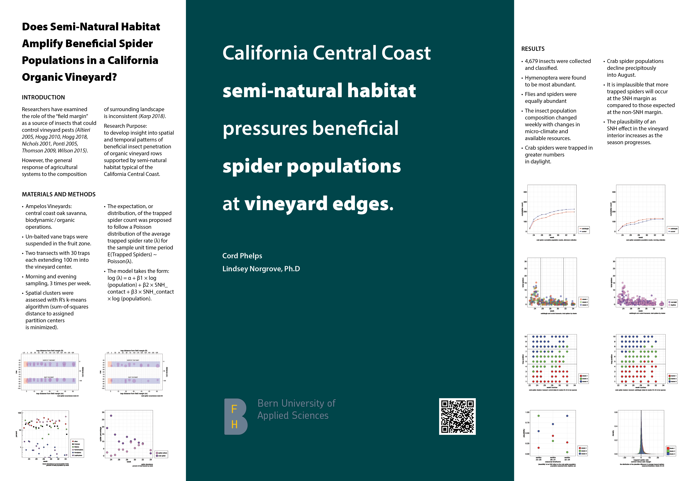

poster presentation: semi-natural habitat and beneficial spiders in a California vineyard

authors: Cord Phelps and Lindsey Norgrove

code and data are freely available in the [parent directory](https://github.com/cordphelps/ampelos) (https://github.com/cordphelps/ampelos)

please direct questions to: rc.phelps@gmail.com

