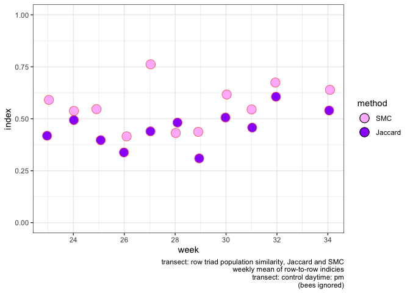
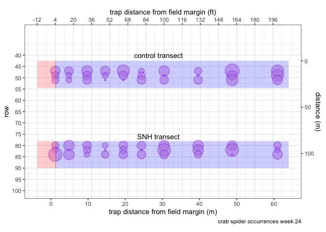
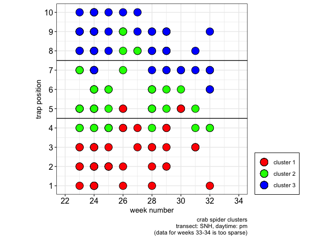
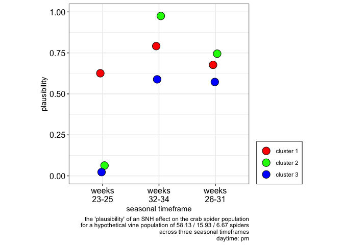
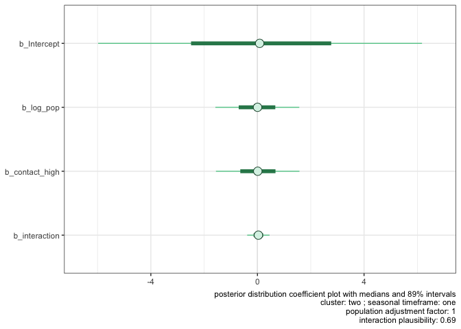
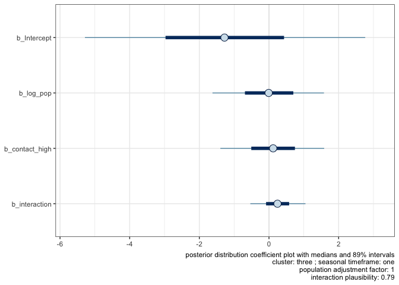
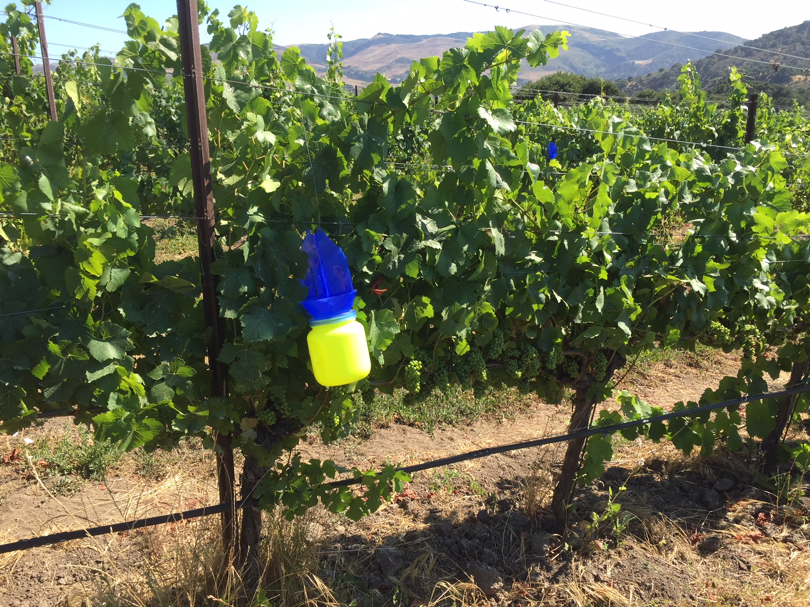

ampelos
================


## how does a ‘natural habitat’ field margin influence the population of beneficial insects in an organic vineyard?

``` r
source("./code/bug-library.R")
source("./code/similarity.R")
source("./code/jaccard-similarity.R")
source("./code/diversity.R")
source("./code/k-means.R")
source("./code/clusterSimilarity.R")
source('./code/bayes.R')
source('./code/ranking.R')

# library(ampelos)   <-- failed replacement for sample.int, 
# see bayes.R likelihoodPlusModelDiags()

source.url <- c("https://raw.githubusercontent.com/cordphelps/ampelos/master/data/bugs.csv")
bugs.df <- read.csv(source.url, header=TRUE, row.names=NULL)

# setwd("./code/thesis/ampelos/")
```

### weekly composition of species and individuals?

``` r
ggsave.path <- "./code/output/"

returnList <- scanBugPercentages(bugs.df)

returnList <- createFamilyPercentages(returnList)

gg <- plotBugPercentages(returnList, spidersOnly=FALSE)

print(gg)
```

<!-- -->

``` r
ggsave("ggsave.insectPop.1.1.pdf", plot = gg, device = NULL, path = ggsave.path,
       scale = 1, width = 6, height = NA, dpi = 300, limitsize = TRUE,
       units = c("in", "cm", "mm"))

gg <- plotBugPercentages(returnList, spidersOnly=TRUE)

print(gg)
```

<!-- -->

``` r
ggsave("ggsave.insectPop.1.2.pdf", plot = gg, device = NULL, path = ggsave.path,
       scale = 1, width = 6, height = NA, dpi = 300, limitsize = TRUE,
       units = c("in", "cm", "mm"))
```

``` r
# (fig.keep='none' suppresses the plots temporarily)

gg.Ind.joint <- divV2(bugs.df, species=FALSE, ignoreBees=FALSE)

print(gg.Ind.joint)
```

<!-- -->

``` r
gg.Species.joint <- divV2(bugs.df, species=TRUE, ignoreBees=FALSE)

print(gg.Species.joint)
```

<!-- -->


### each of the two transects consists of 3 rows of 10 traps in each row. Is the total insect population relatively uniform among the 3 rows of a transect? Does this uniformity change over time? Compute the Jaccard Index for each week: the index *‘is a statistic used for comparing the similarity and diversity of sample sets.’*

##### Note that *‘… the SMC counts both mutual presences (when an attribute is present in both sets) and mutual absence (when an attribute is absent in both sets) as matches and compares it to the total number of attributes in the universe, whereas the Jaccard index only counts mutual presence as matches and compares it to the number of attributes that have been chosen by at least one of the two sets.’* (<https://en.wikipedia.org/wiki/Jaccard_index>)

``` r
library(dplyr)

gOak <- compareJaccardMultiWeekV4(data=bugs.df, ignoreBees=TRUE,
                                  t="oakMargin",
                                  transectText="oakMargin")
```

<!-- -->

``` r
gControl <- compareJaccardMultiWeekV4(data=bugs.df, ignoreBees=TRUE,
                                  t="control",
                                  transectText="control")
```

<!-- -->

### the crab spider is a dominant species in the vineyard. How are they distributed along the length of the row?

#### TO-DO: develop and apply normalization method

``` r
new.df <- bugs.df %>% mutate(newColumn = ifelse(Thomisidae..crab.spider. > 0, 1, 0))

v2.1 <- plotRidgesV2(data=new.df, combined=TRUE, bugs="newColumn", speciesText="crab spider", when="pm", wk=1, caption=Sys.Date())

print(v2.1)
```

<!-- -->

``` r
v2.2 <- plotRidgesV2(data=new.df, combined=TRUE, bugs="newColumn", speciesText="crab spider", when="am", wk=1, caption=Sys.Date())

print(v2.2)
```

<!-- -->

### is there a difference in the spider populations for the two transects?

``` r
ggsave.path <- "./code/output/"

reducedData.df <- selectDataAcrossTransects(data=bugs.df, week=quo(24), species=quo(Thomisidae..crab.spider.))

g24 <- plotBugDistribution(data=reducedData.df, 
                          cap=paste("crab spider occurrences", " week 24", sep=""))
```

<!-- -->

``` r
ggsave("ggsave.overheadCompare.2.1.pdf", plot = g24, device = NULL, path = ggsave.path,
       scale = 1, width = 6, height = NA, dpi = 300, limitsize = TRUE,
       units = c("in", "cm", "mm"))

reducedData.df <- selectDataAcrossTransects(data=bugs.df, week=quo(30), species=quo(Thomisidae..crab.spider.))

g30 <- plotBugDistribution(data=reducedData.df, 
                            cap=paste("crab spider occurrences", " week 30", sep=""))
```

<!-- -->

``` r
ggsave("ggsave.overheadCompare.2.2.pdf", plot = g30, device = NULL, path = ggsave.path,
       scale = 1, width = 6, height = NA, dpi = 300, limitsize = TRUE,
       units = c("in", "cm", "mm"))

# g <- arrangeGrob(g1, g2, nrow=1)
```

### are clusters appearing and do they persist across multiple weeks?

``` r
ggsave.path <- "./code/output/"

clusterNumber <- 3
df <- bugs.df
species <- "Thomisidae..crab.spider."

dataList <- buildClustersByWeek(df, t="control", species="Thomisidae..crab.spider.", cn=clusterNumber)

cl1.gg <- kmPlot(list=dataList, transectText="control")

dataList <- buildClustersByWeek(df, t="oakMargin", species="Thomisidae..crab.spider.", cn=clusterNumber)

cl2.gg <- kmPlot(list=dataList, transectText="oakMargin")

print(cl1.gg)
```

<!-- -->

``` r
print(cl2.gg)
```

<!-- -->

``` r
ggsave("ggsave.overheadClusters.2.1.pdf", plot = cl1.gg, device = NULL, path = ggsave.path,
       scale = 1, width = 6, height = NA, dpi = 300, limitsize = TRUE,
       units = c("in", "cm", "mm"))

ggsave("ggsave.overheadClusters.2.2.pdf", plot = cl2.gg, device = NULL, path = ggsave.path,
       scale = 1, width = 6, height = NA, dpi = 300, limitsize = TRUE,
       units = c("in", "cm", "mm"))
```

#### (control cluster \#2 is slightly wider than oakMargin cluster \#2)

### ‘big picture’ data by cluster, time, and transect

``` r
ggsave.path <- "./code/output/"

if (TRUE) {
  #source('./code/bayes.R')

  # organize data into
  # ("week", "transect", "time", "cluster", "totalSpiders")
  #
  # plot the weekly raw data : plotWeekly()

  returnList <- evaluateDailySpiderCounts(bugs.df)
  
# returnList[[1]] # plotWeekly(total.df) # total spiders by week/cluster differentiated by time of day
# returnList[[2]] <- plotRawWeekly(total.df)
# returnList[[3]] # plotTransectWeekly(total.df)
      ## total.df
      ##
      ## multiple records per week (372 rows) with columns
      ## week, transect, time, cluster, totalSpiders
      ##
# returnList[[4]] <- total.df
# returnList[[5]]   # reserved for likelihood.df
# returnList[[7]]   # reserved for modelInput  (a list of the 9 data sources)
# returnList[[8]]   # reserved for modelOutput (a list of the 9 models)
# returnList[[9]]   # reserved for label.list 
# returnList[[10]]  # reserved for post.df.list (posterior distributions)
# returnList[[11]]  # reserved for mean population for 9 models

  
  print(returnList[[1]]) # scatter plot by cluster with seasonal timeframes
  
  ggsave("ggsave.bigPicture.3.1.pdf", plot = returnList[[1]], device = NULL, path = ggsave.path,
       scale = 1, width = 6, height = NA, dpi = 300, limitsize = TRUE,
       units = c("in", "cm", "mm"))
  
  print(returnList[[2]]) # scatter plot by am/pm
  
  ggsave("ggsave.bigPicture.3.2.pdf", plot = returnList[[2]], device = NULL, path = ggsave.path,
       scale = 1, width = 6, height = NA, dpi = 300, limitsize = TRUE,
       units = c("in", "cm", "mm"))
  
  print(returnList[[3]]) # scatter plot by transect
  #
  # returnList[[4]] is the data 'dataframe' used for the graphics (total.df)
  # from bayes.R evaluateDailySpiderCounts()
  ##
  ## multiple records per week with columns (372 rows)
  ## week, transect, time, cluster, totalSpiders
  ##
 
  
}
```

<!-- --><!-- --><!-- -->

### How plausible is it that a “high contact” (the “oakMargin”) transect row will have more trapped spiders than a “low contact” (the control) transect row?

#### create 9 models, one for each cluster and seasonal timeframe, based on the

#### Oceanic Tool Complexity model of Kline

#### the model predicts the rate of trapped spiders

#### model parameters are log(population), contact rate, and the interaction of both

    ## Loading required package: Rcpp

    ## Registered S3 method overwritten by 'xts':
    ##   method     from
    ##   as.zoo.xts zoo

    ## Loading 'brms' package (version 2.9.0). Useful instructions
    ## can be found by typing help('brms'). A more detailed introduction
    ## to the package is available through vignette('brms_overview').

    ## Loading required package: StanHeaders

    ## rstan (Version 2.19.2, GitRev: 2e1f913d3ca3)

    ## For execution on a local, multicore CPU with excess RAM we recommend calling
    ## options(mc.cores = parallel::detectCores()).
    ## To avoid recompilation of unchanged Stan programs, we recommend calling
    ## rstan_options(auto_write = TRUE)

    ## 
    ## Attaching package: 'rstan'

    ## The following object is masked from 'package:tidyr':
    ## 
    ##     extract

    ## This is bayesplot version 1.7.0

    ## - Online documentation and vignettes at mc-stan.org/bayesplot

    ## - bayesplot theme set to bayesplot::theme_default()

    ##    * Does _not_ affect other ggplot2 plots

    ##    * See ?bayesplot_theme_set for details on theme setting

    ## Warning: 'bayesplot' namespace cannot be unloaded:
    ##   namespace 'bayesplot' is imported by 'shinystan' so cannot be unloaded

    ## Saving 6 x 5 in image

<!-- -->

    ## Saving 6 x 5 in image

<!-- -->

    ## Saving 6 x 5 in image

<!-- -->

    ## Saving 6 x 5 in image

<!-- -->

    ## Saving 6 x 5 in image

<!-- -->

    ## Saving 6 x 5 in image

<!-- -->

    ## Saving 6 x 5 in image

<!-- -->

    ## Saving 6 x 5 in image

<!-- -->

    ## Saving 6 x 5 in image

<!-- -->

    ## Saving 6 x 5 in image

<!-- -->

### mcmc for the models seem reasonable?

``` r
source('./code/bayes.R')

ggsave.path <- "./code/output/"
time <- "pm"

# read the 9 models from disc and run diags
# (debug = TRUE for first model (not all 9) output only)

gg.list <- modelMCMCcheck(path=ggsave.path, daytime=time, debug=TRUE)
```

    ## Loading 'brms' package (version 2.9.0). Useful instructions
    ## can be found by typing help('brms'). A more detailed introduction
    ## to the package is available through vignette('brms_overview').

    ## Registered S3 method overwritten by 'GGally':
    ##   method from   
    ##   +.gg   ggplot2

    ## Loading required package: coda

``` r
for (i in 1:length(gg.list)) {
  
  print(gg.list[[i]])
  
  fileName <- paste("ggsave.mcmcCheck.", i, ".pdf", sep="")
  
  if (file.exists(fileName)) { file.remove(fileName) }

  ggsave(fileName, plot = gg.list[[i]], 
              device = NULL, path = ggsave.path,
              scale = 1, width = 6, height = NA, dpi = 300, limitsize = TRUE,
              units = c("in", "cm", "mm"))
}
```

    ## Saving 6 x 5 in image

<!-- -->

### what are the estimates for parameter coefficients?

``` r
source('./code/bayes.R')

ggsave.path <- "./code/output/"
daytime <- "pm"
seed <- 10

# read the 9 models from disc and run diags
# (debug = TRUE for first model (not all 9) output only)

gg.list <- modelComparison(path=ggsave.path, daytime='pm', randomSeed=seed, debug=TRUE)
```

    ## Loading 'brms' package (version 2.9.0). Useful instructions
    ## can be found by typing help('brms'). A more detailed introduction
    ## to the package is available through vignette('brms_overview').

    ## rstan (Version 2.19.2, GitRev: 2e1f913d3ca3)

    ## For execution on a local, multicore CPU with excess RAM we recommend calling
    ## options(mc.cores = parallel::detectCores()).
    ## To avoid recompilation of unchanged Stan programs, we recommend calling
    ## rstan_options(auto_write = TRUE)

    ## 
    ## Attaching package: 'rstan'

    ## The following object is masked from 'package:coda':
    ## 
    ##     traceplot

    ## The following object is masked from 'package:tidyr':
    ## 
    ##     extract

    ## Start sampling
    ## Start sampling
    ## Start sampling

    ## The desired updates require recompiling the model

    ## Compiling the C++ model

    ## Start sampling

``` r
for (i in 1:length(gg.list)) {
  
  print(gg.list[[i]])
  
  fileName <- paste("ggsave.clusterAltModels.", i, ".pdf", sep="")
  
  if (file.exists(fileName)) { file.remove(fileName) }

  ggsave(fileName, plot = gg.list[[i]], 
              device = NULL, path = ggsave.path,
              scale = 1, width = 6, height = NA, dpi = 300, limitsize = TRUE,
              units = c("in", "cm", "mm"))
}
```

    ## Saving 6 x 5 in image

<!-- -->

### evaluate the effect of “contact rate” on model prediction for 9 models: 3 clusters across 3 seasonal timeframes.

### assume the median spider population per vine varies by seasonal timeframe

### per the results above

#### calculate the expected rate of trapped spiders per vine for high

#### and low contact environments

#### normalize the difference in these two expected rates and plot

#### the difference as an distribution

``` r
source('./code/bayes.R')

ggsave.path <- "./code/output/"
daytime <- "pm"
hypotheticalPopulation <- c(76,47,1)  # hypothetical per vine median population by seasonal timeframe 

# read the 9 models from disc and run diags
gg.list <- modelDiagsV2(daytime='pm', hp=hypotheticalPopulation, path=ggsave.path)

for (i in 1:length(gg.list)) {
  
  print(gg.list[[i]])
  
  fileName <- paste("ggsave.clusterDiags.", i, ".4.2.pdf", sep="")
  
  if (file.exists(fileName)) { file.remove(fileName) }

  ggsave(fileName, plot = gg.list[[i]], 
              device = NULL, path = ggsave.path,
              scale = 1, width = 6, height = NA, dpi = 300, limitsize = TRUE,
              units = c("in", "cm", "mm"))
}
```

    ## Saving 6 x 5 in image

<!-- -->

    ## Saving 6 x 5 in image

<!-- -->

    ## Saving 6 x 5 in image

<!-- -->

    ## Saving 6 x 5 in image

<!-- -->

    ## Saving 6 x 5 in image

<!-- -->

    ## Saving 6 x 5 in image

<!-- -->

    ## Saving 6 x 5 in image

<!-- -->

    ## Saving 6 x 5 in image

<!-- -->

    ## Saving 6 x 5 in image

<!-- -->

    ## Saving 6 x 5 in image

<!-- -->

    ## Saving 6 x 5 in image

<!-- -->

    ## Saving 6 x 5 in image

<!-- -->

### how do the clusters compare to each other across multiple weeks?

``` r
if (FALSE) {   
ggsave.path <- "./code/output/"

# strip out the other arthropods and misc stuff
input.df <- clusterSetup()

# for each 'position', get spiders and assign to a cluster number

#   !!!!!!!! function can't handle "both" !!!!!!!!!!!!!!
#cluster.df <- clusterAccumulateTotal(df, "control", "both")
#clusterBoxplot(cluster.df, "control", "(24 hours)")


#cluster.df <- clusterAccumulateTotal(df, "oakMargin", "both")
#clusterBoxplot(cluster.df, "oakMargin", "(24 hours)")


cluster.df <- clusterAccumulate(df=input.df, t="control", daytime="pm")
  #> cluster.df
  # A tibble: 110 x 3
  #    week spiders cluster
  #   <int>   <int> <chr>  
 #1    23       1 cl1    
 #2    24       8 cl1    
 #3    25       1 cl1    
 #4    26       1 cl1    
 #5    27       1 cl1
clusterBoxplot(cluster.df, "control", "pm")

temp.df <- clusterStats(df=input.df, t="control", daytime="pm")
#> temp.df
#   transect time cluster week       mean        sd normalMean  normalSD distanceTenX
#1   control   pm     cl1   34 0.03703704 0.1924501 0.02941176 0.1538812     1.566667
#2   control   pm     cl1   32 0.03703704 0.1924501 0.02941176 0.1538812     1.566667
#3   control   pm     cl1   31 0.00000000 0.0000000 0.00000000 0.0000000     0.000000
#4   control   pm     cl1   30 0.03703704 0.1924501 0.02941176 0.1538812     1.566667
#5   co

write.table(temp.df, file=paste(ggsave.path, "write.table.clBoxPlotControlPM.txt", sep=""), append = FALSE, sep = '\t', quote = FALSE, col.names = TRUE, dec = ".")

rankControlPM.df <- rankByWeek(df=temp.df)
# > rankControlPM.df
#   week first second third
#1    23   cl2    cl3   cl1
#2    24   cl3    cl1   cl2
#3    25   cl2    cl3   cl1
#4    26   cl2    cl3   cl1
#5    27   cl2    cl1   cl3
bubbleClusterRanks(rankControlPM.df, "control", "pm")


cluster.df <- clusterAccumulate(df=input.df, t="oakMargin", daytime="pm")
clusterBoxplot(cluster.df, "oakMargin", "pm")
temp.df <- clusterStats(df=input.df, t="oakMargin", daytime="pm")

write.table(temp.df, file=paste(ggsave.path, "write.table.clBoxPlotOakPM.txt", sep=""), append = FALSE, sep = '\t', quote = FALSE, col.names = TRUE, dec = ".")

rankOakPM.df <- rankByWeek(df=temp.df)
bubbleClusterRanks(rankOakPM.df, "oakMargin", "pm")

if (FALSE) {
  
  cluster.df <- clusterAccumulate(df=input.df, "control", "am")
  clusterBoxplot(cluster.df, "control", "am")
  temp.df <- clusterStats(df=input.df, t="control", daytime="am")

  write.table(temp.df, file="./code/output/clBoxPlotControlAM.txt", append = FALSE, sep = '\t', quote = FALSE, col.names = TRUE, dec = ".")

  rankControlAM.df <- rankByWeek(df=temp.df)
  bubbleClusterRanks(rankControlAM.df, "control", "am")

  cluster.df <- clusterAccumulate(df=input.df, "oakMargin", "am")
  clusterBoxplot(cluster.df, "oakMargin", "am")
  temp.df <- clusterStats(df=input.df, t="oakMargin", daytime="am")

  write.table(temp.df, file="./code/output/clBoxPlotOakAM.txt", append = FALSE, 
              sep = '\t', quote = FALSE, col.names = TRUE, dec = ".")

  rankOakAM.df <- rankByWeek(df=temp.df)
  bubbleClusterRanks(rankOakPM.df, "oakMargin", "am")

}
}
```

### does the crab spider population appear to change over time? Is there a difference between the two transects?

``` r
g.gg <- plotSpeciesTrendV3(data=bugs.df, species=quo(Thomisidae..crab.spider.), period="am", trend=TRUE, speciesText="Crab Spider", lowerWeekLimit=23, upperWeekLimit=34, caption=Sys.Date())
```

<!-- -->

``` r
g.gg <- plotSpeciesTrendV3(data=bugs.df, species=quo(Thomisidae..crab.spider.), period="am", trend=FALSE, speciesText="Crab Spider", lowerWeekLimit=23, upperWeekLimit=34, caption=Sys.Date())
```

<!-- --><!-- --><!-- -->

``` r
g.gg <- plotSpeciesTrendV3(data=bugs.df, species=quo(Thomisidae..crab.spider.), period="pm", trend=TRUE, speciesText="Crab Spider", lowerWeekLimit=23, upperWeekLimit=34, caption=Sys.Date())
```

<!-- -->

``` r
g.gg <- plotSpeciesTrendV3(data=bugs.df, species=quo(Thomisidae..crab.spider.), period="pm", trend=FALSE, speciesText="Crab Spider", lowerWeekLimit=23, upperWeekLimit=34, caption=Sys.Date())
```

<!-- --><!-- --><!-- -->

``` r
ggsave.path <- "./code/output/"

g.gg.am <- plotSpeciesTrendV3(data=bugs.df, species=quo(Thomisidae..crab.spider.), period="am", trend=FALSE, speciesText="Crab Spider", lowerWeekLimit=23, upperWeekLimit=34, caption=Sys.Date())
```

<!-- --><!-- --><!-- -->

``` r
ggsave("ggsave.pop.trends.right.1.2.pdf", plot = g.gg.am, device = NULL, 
       path = ggsave.path,
       scale = 1, width = 6, height = NA, dpi = 300, limitsize = TRUE,
       units = c("in", "cm", "mm"))

g.gg.pm <- plotSpeciesTrendV3(data=bugs.df, species=quo(Thomisidae..crab.spider.), period="pm", trend=FALSE, speciesText="Crab Spider", lowerWeekLimit=23, upperWeekLimit=34, caption=Sys.Date())
```

<!-- --><!-- --><!-- -->

``` r
ggsave("ggsave.pop.trends.right.1.1.pdf", plot = g.gg.pm, device = NULL, 
       path = ggsave.path,
       scale = 1, width = 6, height = NA, dpi = 300, limitsize = TRUE,
       units = c("in", "cm", "mm"))
```

### and the species counts?

<table>

<thead>

<tr>

<th style="text-align:left;">

</th>

<th style="text-align:right;">

count

</th>

<th style="text-align:right;">

percentage

</th>

</tr>

</thead>

<tbody>

<tr>

<td style="text-align:left;">

Diptera..Agromyzidae..leafminer..

</td>

<td style="text-align:right;">

893

</td>

<td style="text-align:right;">

19.09

</td>

</tr>

<tr>

<td style="text-align:left;">

Braconid.wasp

</td>

<td style="text-align:right;">

73

</td>

<td style="text-align:right;">

1.56

</td>

</tr>

<tr>

<td style="text-align:left;">

Halictus.sp….3.part..native.bee.

</td>

<td style="text-align:right;">

522

</td>

<td style="text-align:right;">

11.16

</td>

</tr>

<tr>

<td style="text-align:left;">

pencilBug

</td>

<td style="text-align:right;">

60

</td>

<td style="text-align:right;">

1.28

</td>

</tr>

<tr>

<td style="text-align:left;">

Agapostemon.sp….green..native.bee.

</td>

<td style="text-align:right;">

81

</td>

<td style="text-align:right;">

1.73

</td>

</tr>

<tr>

<td style="text-align:left;">

Osmia.sp…native.bee.

</td>

<td style="text-align:right;">

62

</td>

<td style="text-align:right;">

1.33

</td>

</tr>

<tr>

<td style="text-align:left;">

Honey.Bee

</td>

<td style="text-align:right;">

476

</td>

<td style="text-align:right;">

10.17

</td>

</tr>

<tr>

<td style="text-align:left;">

Bombus.californicus..bumble.

</td>

<td style="text-align:right;">

279

</td>

<td style="text-align:right;">

5.96

</td>

</tr>

<tr>

<td style="text-align:left;">

Thomisidae..crab.spider.

</td>

<td style="text-align:right;">

680

</td>

<td style="text-align:right;">

14.53

</td>

</tr>

<tr>

<td style="text-align:left;">

spider.other

</td>

<td style="text-align:right;">

171

</td>

<td style="text-align:right;">

3.65

</td>

</tr>

<tr>

<td style="text-align:left;">

ladyBug

</td>

<td style="text-align:right;">

46

</td>

<td style="text-align:right;">

0.98

</td>

</tr>

<tr>

<td style="text-align:left;">

Lygus.hesperus..western.tarnished.plant.bug.

</td>

<td style="text-align:right;">

37

</td>

<td style="text-align:right;">

0.79

</td>

</tr>

<tr>

<td style="text-align:left;">

pentamonidae…stinkBug.

</td>

<td style="text-align:right;">

15

</td>

<td style="text-align:right;">

0.32

</td>

</tr>

<tr>

<td style="text-align:left;">

other

</td>

<td style="text-align:right;">

1213

</td>

<td style="text-align:right;">

25.92

</td>

</tr>

<tr>

<td style="text-align:left;">

checkerspot.butterfly

</td>

<td style="text-align:right;">

27

</td>

<td style="text-align:right;">

0.58

</td>

</tr>

<tr>

<td style="text-align:left;">

Pyralidae..Snout.Moth.

</td>

<td style="text-align:right;">

17

</td>

<td style="text-align:right;">

0.36

</td>

</tr>

<tr>

<td style="text-align:left;">

Diabrotica.undecimpunctata..Cucumber.Beetle.

</td>

<td style="text-align:right;">

18

</td>

<td style="text-align:right;">

0.38

</td>

</tr>

<tr>

<td style="text-align:left;">

Orius..pirate.bug.

</td>

<td style="text-align:right;">

9

</td>

<td style="text-align:right;">

0.19

</td>

</tr>

</tbody>

</table>

### how about the insect populations themselves? Is the presence of any particular species correlated with the presence of a different species?

``` r
m1 <- simMatrixV3(data=bugs.df, transect=quo("oakMargin"),
                                transectText="oakMargin")
```


``` r
#g <- arrangeGrob(m1, m2, nrow=2)
```

``` r
m2 <- simMatrixV3(data=bugs.df, transect=quo("control"),
                                transectText="control")
```


``` r
#g <- arrangeGrob(m1, m2, nrow=2)
```

### bottom of the Oak Transect; bird repellant streamers indicating the prevailing wind direction


### top of the Control Transect


### bottom of the Control Transect with bird repellant streamers


### typical trap positioning; bowl in the fruit zone, vanes intersecting the canopy



### example trap sequence


