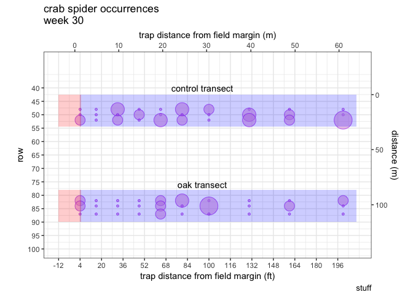
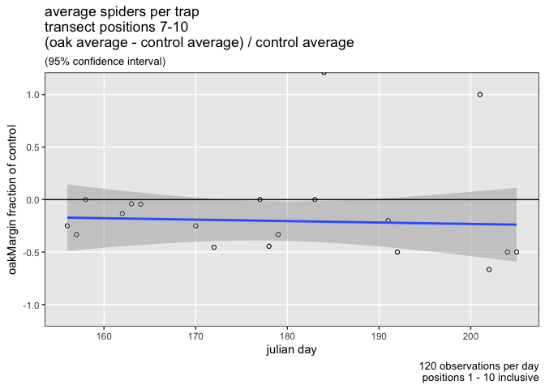
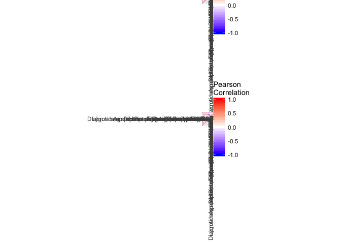
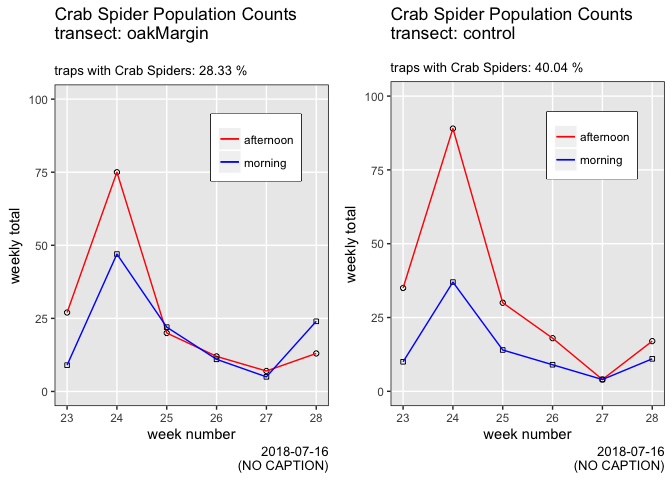
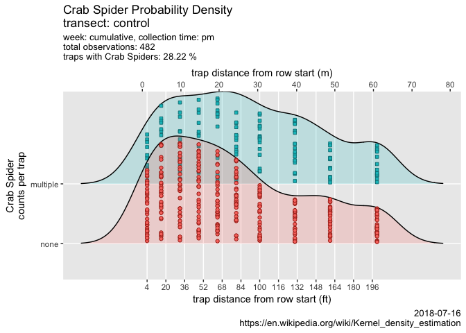

ampelos
================

[]()

``` r
source("./bug-library.R")

source.url <- c("https://raw.githubusercontent.com/cordphelps/ampelos/master/bugs.csv")
bugs.df <- read.csv(source.url, header=TRUE, row.names=NULL)
```

``` r
g <- compareTransect()
```


    ## Warning: Removed 2 rows containing non-finite values (stat_smooth).

    ## Warning: Removed 2 rows containing missing values (geom_point).



    ## Warning: Removed 2 rows containing non-finite values (stat_smooth).

    ## Warning: Removed 2 rows containing missing values (geom_point).



``` r
newFile <- paste("ampelos-", format(Sys.time(), "%d-%m-%Y-%H%M"), ".pdf", sep = "")
ggsave(file=newFile, g, width=20, height=30, device = "pdf", units = "cm") #saves g

# pass variables to dyplr pipes
# https://stackoverflow.com/questions/27975124/pass-arguments-to-dplyr-functions
plotSpeciesTrend(data=bugs.df, bugs=quo(Thomisidae..crab.spider.), speciesText="Crab Spider", where="control", when="pm", caption=Sys.Date())
```



    ## NULL

``` r
plotRidges(data=bugs.df, combined=FALSE, bugs="Thomisidae..crab.spider.", speciesText="Crab Spider", where="control", when="pm", wk=1, caption=Sys.Date())
```

    ## Scale for 'x' is already present. Adding another scale for 'x', which
    ## will replace the existing scale.

    ## Picking joint bandwidth of 29.1


``` r
new.df <- bugs.df %>% mutate(newColumn = ifelse(Thomisidae..crab.spider. > 0, 1, 0))
plotRidges(data=new.df, combined=TRUE, bugs="newColumn", speciesText="Crab Spider", where="control", when="pm", wk=1, caption=Sys.Date())
```

    ## Scale for 'x' is already present. Adding another scale for 'x', which
    ## will replace the existing scale.

    ## Picking joint bandwidth of 19.6


``` r
plotRidges(data=new.df, combined=TRUE, bugs="newColumn", speciesText="Crab Spider", where="oakMargin", when="pm", wk=1, caption=Sys.Date())
```

    ## Scale for 'x' is already present. Adding another scale for 'x', which
    ## will replace the existing scale.

    ## Picking joint bandwidth of 19.9



<table>
<thead>
<tr>
<th style="text-align:left;">
</th>
<th style="text-align:right;">
count
</th>
<th style="text-align:right;">
percentage
</th>
</tr>
</thead>
<tbody>
<tr>
<td style="text-align:left;">
Diptera..Agromyzidae..leafminer..
</td>
<td style="text-align:right;">
638
</td>
<td style="text-align:right;">
26.52
</td>
</tr>
<tr>
<td style="text-align:left;">
Braconid.wasp
</td>
<td style="text-align:right;">
24
</td>
<td style="text-align:right;">
1.00
</td>
</tr>
<tr>
<td style="text-align:left;">
Halictus.sp....3.part..native.bee.
</td>
<td style="text-align:right;">
159
</td>
<td style="text-align:right;">
6.61
</td>
</tr>
<tr>
<td style="text-align:left;">
pencilBug
</td>
<td style="text-align:right;">
40
</td>
<td style="text-align:right;">
1.66
</td>
</tr>
<tr>
<td style="text-align:left;">
Agapostemon.sp....green..native.bee.
</td>
<td style="text-align:right;">
26
</td>
<td style="text-align:right;">
1.08
</td>
</tr>
<tr>
<td style="text-align:left;">
Osmia.sp...native.bee.
</td>
<td style="text-align:right;">
58
</td>
<td style="text-align:right;">
2.41
</td>
</tr>
<tr>
<td style="text-align:left;">
Honey.Bee
</td>
<td style="text-align:right;">
248
</td>
<td style="text-align:right;">
10.31
</td>
</tr>
<tr>
<td style="text-align:left;">
Bombus.californicus..bumble.
</td>
<td style="text-align:right;">
171
</td>
<td style="text-align:right;">
7.11
</td>
</tr>
<tr>
<td style="text-align:left;">
Thomisidae..crab.spider.
</td>
<td style="text-align:right;">
465
</td>
<td style="text-align:right;">
19.33
</td>
</tr>
<tr>
<td style="text-align:left;">
spider.other
</td>
<td style="text-align:right;">
37
</td>
<td style="text-align:right;">
1.54
</td>
</tr>
<tr>
<td style="text-align:left;">
ladyBug
</td>
<td style="text-align:right;">
15
</td>
<td style="text-align:right;">
0.62
</td>
</tr>
<tr>
<td style="text-align:left;">
Lygus.hesperus..western.tarnished.plant.bug.
</td>
<td style="text-align:right;">
26
</td>
<td style="text-align:right;">
1.08
</td>
</tr>
<tr>
<td style="text-align:left;">
pentamonidae...stinkBug.
</td>
<td style="text-align:right;">
9
</td>
<td style="text-align:right;">
0.37
</td>
</tr>
<tr>
<td style="text-align:left;">
other
</td>
<td style="text-align:right;">
440
</td>
<td style="text-align:right;">
18.29
</td>
</tr>
<tr>
<td style="text-align:left;">
checkerspot.butterfly
</td>
<td style="text-align:right;">
25
</td>
<td style="text-align:right;">
1.04
</td>
</tr>
<tr>
<td style="text-align:left;">
Pyralidae..Snout.Moth.
</td>
<td style="text-align:right;">
13
</td>
<td style="text-align:right;">
0.54
</td>
</tr>
<tr>
<td style="text-align:left;">
Diabrotica.undecimpunctata..Cucumber.Beetle.
</td>
<td style="text-align:right;">
9
</td>
<td style="text-align:right;">
0.37
</td>
</tr>
<tr>
<td style="text-align:left;">
Orius..pirate.bug.
</td>
<td style="text-align:right;">
3
</td>
<td style="text-align:right;">
0.12
</td>
</tr>
</tbody>
</table>
