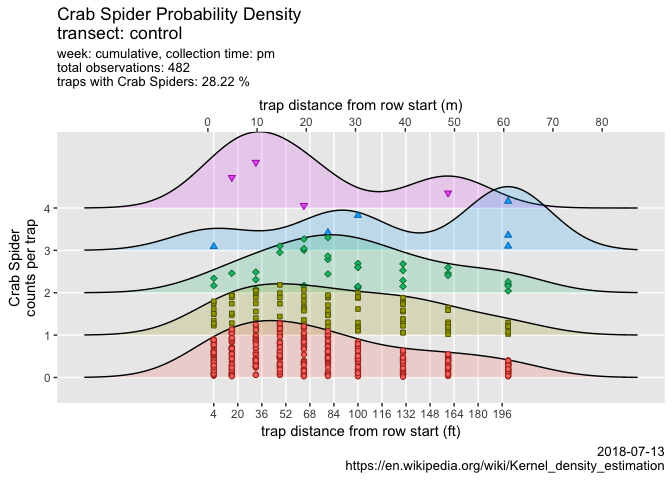
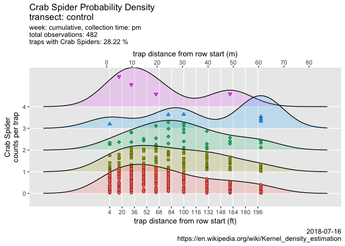

ampelos
================

``` r
source("./bug-library.R")

source.url <- c("https://raw.githubusercontent.com/cordphelps/ampelos/master/bugs.csv")
bugs.df <- read.csv(source.url, header=TRUE, row.names=NULL)
```

``` r
# g <- compareTransect()
# newFile <- paste("ampelos-", format(Sys.time(), "%d-%m-%Y-%H%M"), ".pdf", sep = "")
# ggsave(file=newFile, g, width=20, height=30, device = "pdf", units = "cm") #saves g

positionText <- paste("\ntransect positions ", "1-3", sep="")
g3 <- compareTransectUsingQuosure(data=bugs.df, 
                                 species=quo(Thomisidae..crab.spider.), 
                                 operator="LT",
                                 initialPosition=quo(4), 
                                 secondaryPosition=quo(0),
                                 positionText)
```

    ## Warning: Removed 2 rows containing non-finite values (stat_smooth).

    ## Warning: Removed 1 rows containing missing values (geom_point).


``` r
positionText <- paste("\ntransect positions ", "4-6", sep="")
g46 <- compareTransectUsingQuosure(data=bugs.df, 
                                 species=quo(Thomisidae..crab.spider.), 
                                 operator="BETWEEN",
                                 initialPosition=quo(3), 
                                 secondaryPosition=quo(7),
                                 positionText)
```

    ## Warning: Removed 2 rows containing non-finite values (stat_smooth).

    ## Warning: Removed 1 rows containing missing values (geom_point).


``` r
positionText <- paste("\ntransect positions ", "7-10", sep="")
g7 <- compareTransectUsingQuosure(data=bugs.df, 
                                 species=quo(Thomisidae..crab.spider.), 
                                 operator="GT",
                                 initialPosition=quo(6), 
                                 secondaryPosition=quo(0),
                                 positionText)
```

    ## Warning: Removed 2 rows containing non-finite values (stat_smooth).

    ## Warning: Removed 1 rows containing missing values (geom_point).


``` r
g <- arrangeGrob(g3, g46, g7, nrow=3)
newFile <- paste("ampelos-", format(Sys.time(), "%d-%m-%Y-%H%M"), ".pdf", sep = "")
ggsave(file=newFile, g, width=20, height=30, device = "pdf", units = "cm") #saves g

# pass variables to dyplr pipes
# https://stackoverflow.com/questions/27975124/pass-arguments-to-dplyr-functions
plotSpeciesTrend(data=bugs.df, bugs=quo(Thomisidae..crab.spider.), speciesText="Crab Spider", where="control", when="pm", caption=Sys.Date())
```


    ## NULL

``` r
plotRidges(data=bugs.df, combined=FALSE, bugs="Thomisidae..crab.spider.", speciesText="Crab Spider", where="control", when="pm", wk=1, caption=Sys.Date())
```

    ## Scale for 'x' is already present. Adding another scale for 'x', which
    ## will replace the existing scale.

    ## Picking joint bandwidth of 28.8



``` r
new.df <- bugs.df %>% mutate(newColumn = ifelse(Thomisidae..crab.spider. > 0, 1, 0))
plotRidges(data=new.df, combined=TRUE, bugs="newColumn", speciesText="Crab Spider", where="control", when="pm", wk=1, caption=Sys.Date())
```

    ## Scale for 'x' is already present. Adding another scale for 'x', which
    ## will replace the existing scale.

    ## Picking joint bandwidth of 19.1



``` r
plotRidges(data=new.df, combined=TRUE, bugs="newColumn", speciesText="Crab Spider", where="oakMargin", when="pm", wk=1, caption=Sys.Date())
```

    ## Scale for 'x' is already present. Adding another scale for 'x', which
    ## will replace the existing scale.

    ## Picking joint bandwidth of 19.6


<table>
<thead>
<tr>
<th style="text-align:left;">
</th>
<th style="text-align:right;">
count
</th>
<th style="text-align:right;">
percentage
</th>
</tr>
</thead>
<tbody>
<tr>
<td style="text-align:left;">
Diptera..Agromyzidae..leafminer..
</td>
<td style="text-align:right;">
684
</td>
<td style="text-align:right;">
24.31
</td>
</tr>
<tr>
<td style="text-align:left;">
Braconid.wasp
</td>
<td style="text-align:right;">
29
</td>
<td style="text-align:right;">
1.03
</td>
</tr>
<tr>
<td style="text-align:left;">
Halictus.sp....3.part..native.bee.
</td>
<td style="text-align:right;">
182
</td>
<td style="text-align:right;">
6.47
</td>
</tr>
<tr>
<td style="text-align:left;">
pencilBug
</td>
<td style="text-align:right;">
41
</td>
<td style="text-align:right;">
1.46
</td>
</tr>
<tr>
<td style="text-align:left;">
Agapostemon.sp....green..native.bee.
</td>
<td style="text-align:right;">
32
</td>
<td style="text-align:right;">
1.14
</td>
</tr>
<tr>
<td style="text-align:left;">
Osmia.sp...native.bee.
</td>
<td style="text-align:right;">
59
</td>
<td style="text-align:right;">
2.10
</td>
</tr>
<tr>
<td style="text-align:left;">
Honey.Bee
</td>
<td style="text-align:right;">
299
</td>
<td style="text-align:right;">
10.63
</td>
</tr>
<tr>
<td style="text-align:left;">
Bombus.californicus..bumble.
</td>
<td style="text-align:right;">
194
</td>
<td style="text-align:right;">
6.89
</td>
</tr>
<tr>
<td style="text-align:left;">
Thomisidae..crab.spider.
</td>
<td style="text-align:right;">
510
</td>
<td style="text-align:right;">
18.12
</td>
</tr>
<tr>
<td style="text-align:left;">
spider.other
</td>
<td style="text-align:right;">
51
</td>
<td style="text-align:right;">
1.81
</td>
</tr>
<tr>
<td style="text-align:left;">
ladyBug
</td>
<td style="text-align:right;">
18
</td>
<td style="text-align:right;">
0.64
</td>
</tr>
<tr>
<td style="text-align:left;">
Lygus.hesperus..western.tarnished.plant.bug.
</td>
<td style="text-align:right;">
30
</td>
<td style="text-align:right;">
1.07
</td>
</tr>
<tr>
<td style="text-align:left;">
pentamonidae...stinkBug.
</td>
<td style="text-align:right;">
10
</td>
<td style="text-align:right;">
0.36
</td>
</tr>
<tr>
<td style="text-align:left;">
other
</td>
<td style="text-align:right;">
620
</td>
<td style="text-align:right;">
22.03
</td>
</tr>
<tr>
<td style="text-align:left;">
checkerspot.butterfly
</td>
<td style="text-align:right;">
25
</td>
<td style="text-align:right;">
0.89
</td>
</tr>
<tr>
<td style="text-align:left;">
Pyralidae..Snout.Moth.
</td>
<td style="text-align:right;">
15
</td>
<td style="text-align:right;">
0.53
</td>
</tr>
<tr>
<td style="text-align:left;">
Diabrotica.undecimpunctata..Cucumber.Beetle.
</td>
<td style="text-align:right;">
10
</td>
<td style="text-align:right;">
0.36
</td>
</tr>
<tr>
<td style="text-align:left;">
Orius..pirate.bug.
</td>
<td style="text-align:right;">
5
</td>
<td style="text-align:right;">
0.18
</td>
</tr>
</tbody>
</table>
