ampelos
================


## how does a ‘semi-natural habitat’ (SNH) field margin influence the population of beneficial insects in an organic vineyard?

### weekly composition of species and individuals?

    ## Warning: Transformation introduced infinite values in continuous y-axis
    
    ## Warning: Transformation introduced infinite values in continuous y-axis
    
    ## Warning: Transformation introduced infinite values in continuous y-axis

<!-- -->

    ## Warning: Transformation introduced infinite values in continuous y-axis
    
    ## Warning: Transformation introduced infinite values in continuous y-axis
    
    ## Warning: Transformation introduced infinite values in continuous y-axis

<!-- -->

### ‘big picture’ data by time and transect

    ## Warning: filter_() is deprecated. 
    ## Please use filter() instead
    ## 
    ## The 'programming' vignette or the tidyeval book can help you
    ## to program with filter() : https://tidyeval.tidyverse.org
    ## This warning is displayed once per session.

<!-- -->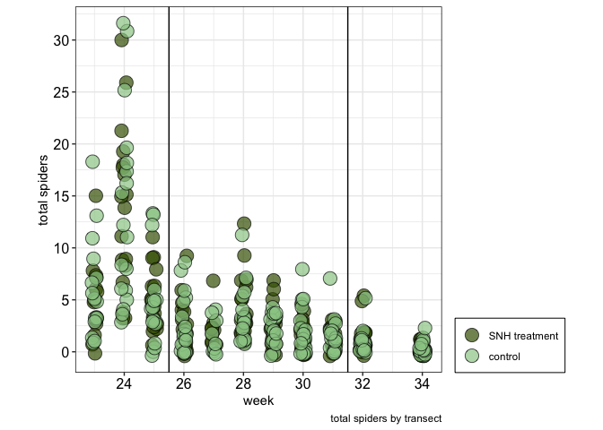<!-- -->

### are clusters appearing and do they persist across multiple weeks?

#### (yes, using the kmeans() algorithm, clusters interpreted as follows: cluster 1 is rows 1-4, cluster 2 is rows 5-7, and cluster 3 is rows 8-10. this assessment is hardcoded in evaluateDailySpiderCounts() )

<!-- --><!-- -->

### How plausible is it that a “high contact” (“SNH”) transect row will have more trapped spiders than a “low contact” (control) transect row?

#### create 9 models, one for each cluster and seasonal timeframe, based on the Oceanic Tool Complexity model of Kline. The model predicts the rate of trapped spiders, model parameters are log(population), contact rate, and the interaction of both

    ## Warning: 'bayesplot' namespace cannot be unloaded:
    ##   namespace 'bayesplot' is imported by 'shinystan' so cannot be unloaded

<!-- --><!-- --><!-- --><!-- --><!-- --><!-- -->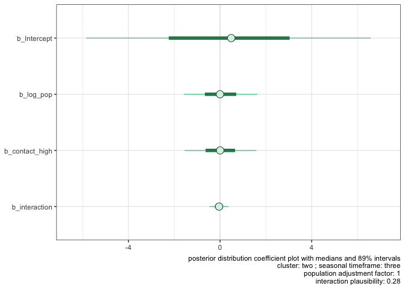<!-- --><!-- -->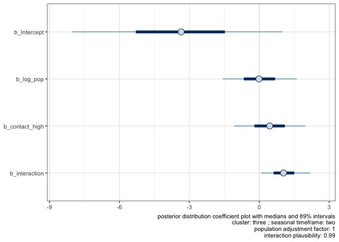<!-- -->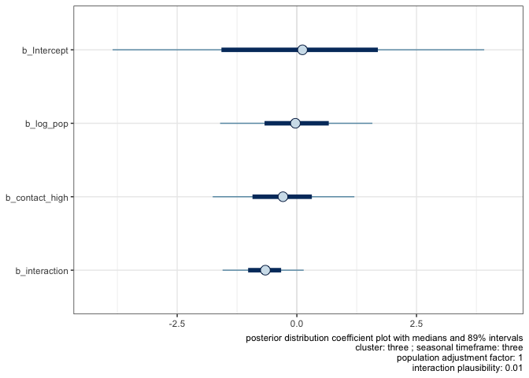<!-- -->

### mcmc for the models seem reasonable?

#### yes, trace plots suggest convergence of the chains that form the model parameter posterior distributions (<https://www.rensvandeschoot.com/brms-wambs/> paragraph 2)

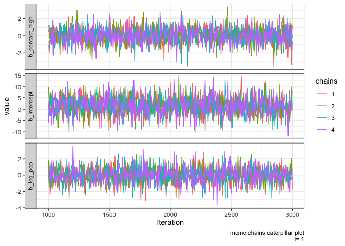<!-- -->

### compare variations of the basic model to determine which parameters are most meaningful.

<!-- -->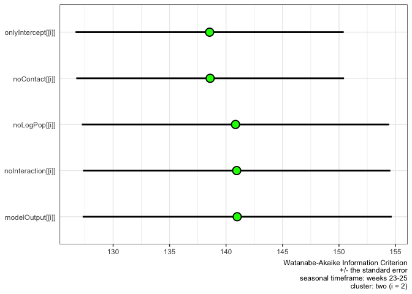<!-- -->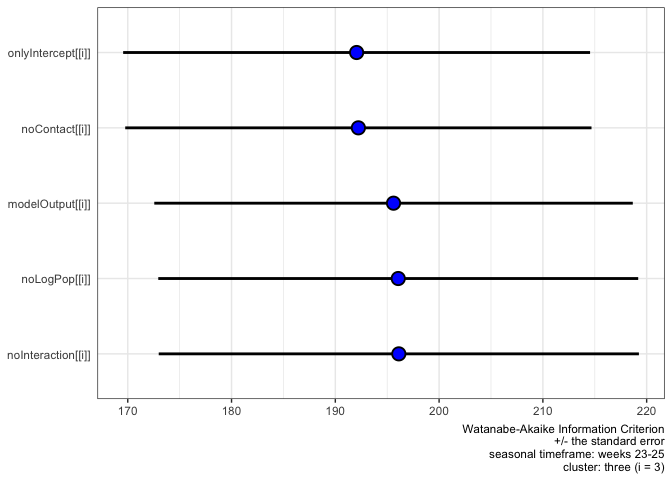<!-- --><!-- -->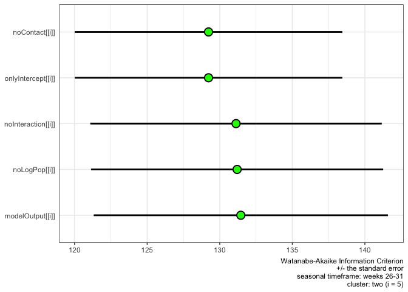<!-- --><!-- -->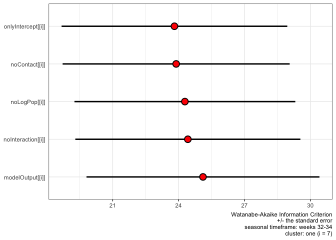<!-- -->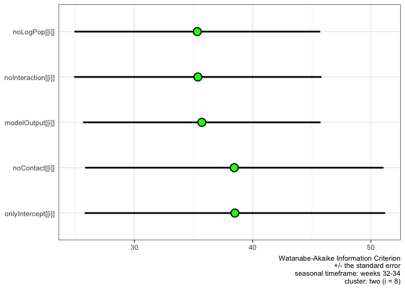<!-- --><!-- -->

### evaluate the effect of “contact rate” on model prediction for 9 models: 3 clusters across 3 seasonal timeframes. assume the median spider population per vine varies by seasonal timeframe per the results above

#### calculate the posterior distribution of the expected rate of trapped spiders per vine for high and low contact environments, normalize the difference in these two expected rates and plot the difference. Do the distributions look reasonable?

#### yes, the number of mcmc iterations seem sufficient as the distributions are single peaked and smooth. (<https://www.rensvandeschoot.com/brms-wambs/> paragraph 4) They also have reasonable bounds. (<https://www.rensvandeschoot.com/brms-wambs/> paragraph 6)

<!-- --><!-- --><!-- --><!-- --><!-- --><!-- --><!-- --><!-- --><!-- --><!-- --><!-- --><!-- -->

### how do the clusters compare to each other across multiple weeks?

### does the crab spider population appear to change over time? Is there a difference between the two transects?

``` r
g.gg <- plotSpeciesTrendV3(data=bugs.df, species=quo(Thomisidae..crab.spider.), period="am", trend=TRUE, speciesText="Crab Spider", lowerWeekLimit=23, upperWeekLimit=34, caption=Sys.Date())
```

<!-- -->

``` r
g.gg <- plotSpeciesTrendV3(data=bugs.df, species=quo(Thomisidae..crab.spider.), period="am", trend=FALSE, speciesText="Crab Spider", lowerWeekLimit=23, upperWeekLimit=34, caption=Sys.Date())
```

<!-- --><!-- --><!-- -->

<!-- --><!-- --><!-- --><!-- -->

### the crab spider is a dominant species in the vineyard. How are they distributed along the length of the row?

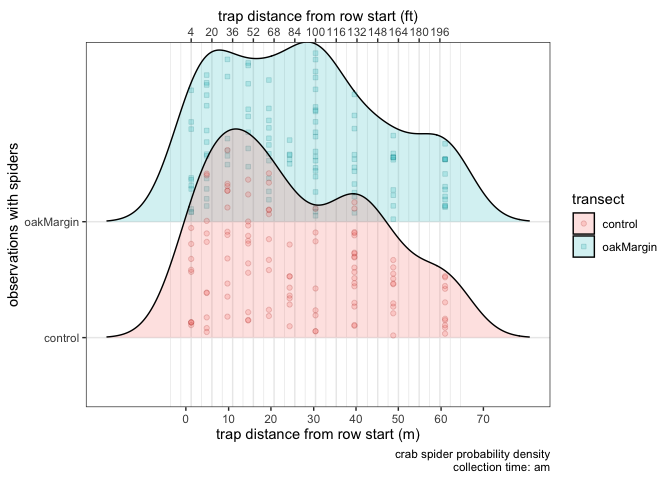<!-- --><!-- -->

<!-- --><!-- --><!-- --><!-- --><!-- --><!-- -->


### each of the two transects consists of 3 rows of 10 traps in each row. Is the total insect population relatively uniform among the 3 rows of a transect? Does this uniformity change over time? Compute the Jaccard Index for each week: the index *‘is a statistic used for comparing the similarity and diversity of sample sets.’*

##### Note that *‘… the SMC counts both mutual presences (when an attribute is present in both sets) and mutual absence (when an attribute is absent in both sets) as matches and compares it to the total number of attributes in the universe, whereas the Jaccard index only counts mutual presence as matches and compares it to the number of attributes that have been chosen by at least one of the two sets.’* (<https://en.wikipedia.org/wiki/Jaccard_index>)

    ## Warning: funs() is soft deprecated as of dplyr 0.8.0
    ## Please use a list of either functions or lambdas: 
    ## 
    ##   # Simple named list: 
    ##   list(mean = mean, median = median)
    ## 
    ##   # Auto named with `tibble::lst()`: 
    ##   tibble::lst(mean, median)
    ## 
    ##   # Using lambdas
    ##   list(~ mean(., trim = .2), ~ median(., na.rm = TRUE))
    ## This warning is displayed once per session.

    ## Warning: Removed 1 rows containing missing values (geom_point).

<!-- --><!-- -->

### is there a difference in the spider populations for the two transects?

<!-- --><!-- -->

<!-- -->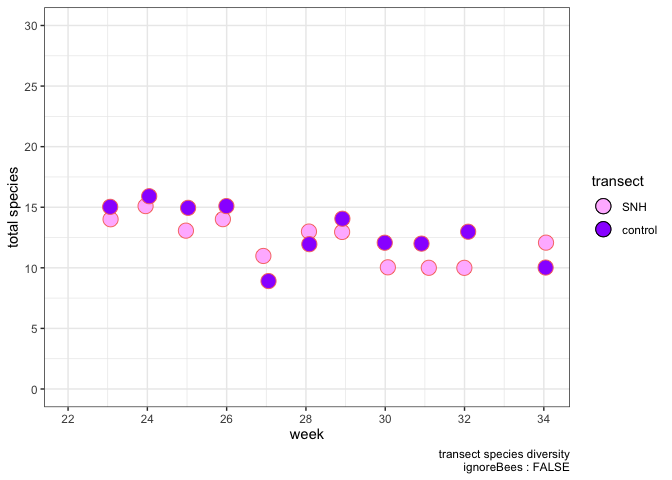<!-- -->

### and the species counts?

<table>

<thead>

<tr>

<th style="text-align:left;">

</th>

<th style="text-align:right;">

count

</th>

<th style="text-align:right;">

percentage

</th>

</tr>

</thead>

<tbody>

<tr>

<td style="text-align:left;">

Diptera..Agromyzidae..leafminer..

</td>

<td style="text-align:right;">

893

</td>

<td style="text-align:right;">

19.09

</td>

</tr>

<tr>

<td style="text-align:left;">

Braconid.wasp

</td>

<td style="text-align:right;">

73

</td>

<td style="text-align:right;">

1.56

</td>

</tr>

<tr>

<td style="text-align:left;">

Halictus.sp….3.part..native.bee.

</td>

<td style="text-align:right;">

522

</td>

<td style="text-align:right;">

11.16

</td>

</tr>

<tr>

<td style="text-align:left;">

pencilBug

</td>

<td style="text-align:right;">

60

</td>

<td style="text-align:right;">

1.28

</td>

</tr>

<tr>

<td style="text-align:left;">

Agapostemon.sp….green..native.bee.

</td>

<td style="text-align:right;">

81

</td>

<td style="text-align:right;">

1.73

</td>

</tr>

<tr>

<td style="text-align:left;">

Osmia.sp…native.bee.

</td>

<td style="text-align:right;">

62

</td>

<td style="text-align:right;">

1.33

</td>

</tr>

<tr>

<td style="text-align:left;">

Honey.Bee

</td>

<td style="text-align:right;">

476

</td>

<td style="text-align:right;">

10.17

</td>

</tr>

<tr>

<td style="text-align:left;">

Bombus.californicus..bumble.

</td>

<td style="text-align:right;">

279

</td>

<td style="text-align:right;">

5.96

</td>

</tr>

<tr>

<td style="text-align:left;">

Thomisidae..crab.spider.

</td>

<td style="text-align:right;">

680

</td>

<td style="text-align:right;">

14.53

</td>

</tr>

<tr>

<td style="text-align:left;">

spider.other

</td>

<td style="text-align:right;">

171

</td>

<td style="text-align:right;">

3.65

</td>

</tr>

<tr>

<td style="text-align:left;">

ladyBug

</td>

<td style="text-align:right;">

46

</td>

<td style="text-align:right;">

0.98

</td>

</tr>

<tr>

<td style="text-align:left;">

Lygus.hesperus..western.tarnished.plant.bug.

</td>

<td style="text-align:right;">

37

</td>

<td style="text-align:right;">

0.79

</td>

</tr>

<tr>

<td style="text-align:left;">

pentamonidae…stinkBug.

</td>

<td style="text-align:right;">

15

</td>

<td style="text-align:right;">

0.32

</td>

</tr>

<tr>

<td style="text-align:left;">

other

</td>

<td style="text-align:right;">

1213

</td>

<td style="text-align:right;">

25.92

</td>

</tr>

<tr>

<td style="text-align:left;">

checkerspot.butterfly

</td>

<td style="text-align:right;">

27

</td>

<td style="text-align:right;">

0.58

</td>

</tr>

<tr>

<td style="text-align:left;">

Pyralidae..Snout.Moth.

</td>

<td style="text-align:right;">

17

</td>

<td style="text-align:right;">

0.36

</td>

</tr>

<tr>

<td style="text-align:left;">

Diabrotica.undecimpunctata..Cucumber.Beetle.

</td>

<td style="text-align:right;">

18

</td>

<td style="text-align:right;">

0.38

</td>

</tr>

<tr>

<td style="text-align:left;">

Orius..pirate.bug.

</td>

<td style="text-align:right;">

9

</td>

<td style="text-align:right;">

0.19

</td>

</tr>

</tbody>

</table>

### how about the insect populations themselves? Is the presence of any particular species correlated with the presence of a different species?


### bottom of the Oak Transect; bird repellant streamers indicating the prevailing wind direction


### top of the Control Transect


### bottom of the Control Transect with bird repellant streamers


### typical trap positioning; bowl in the fruit zone, vanes intersecting the canopy


### example trap sequence


