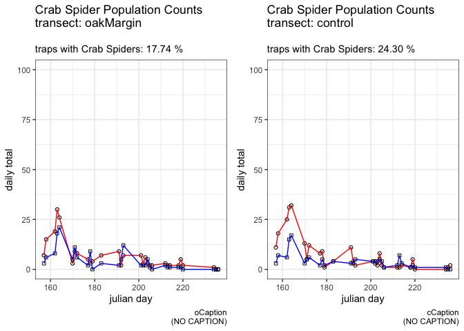
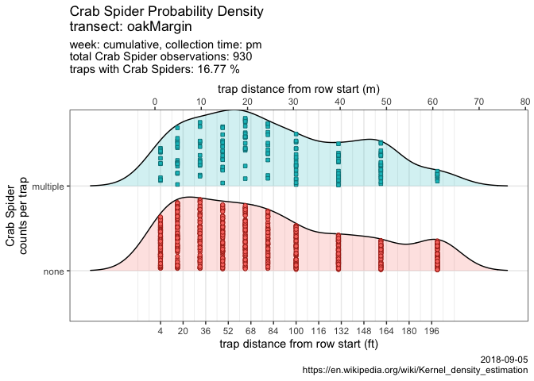
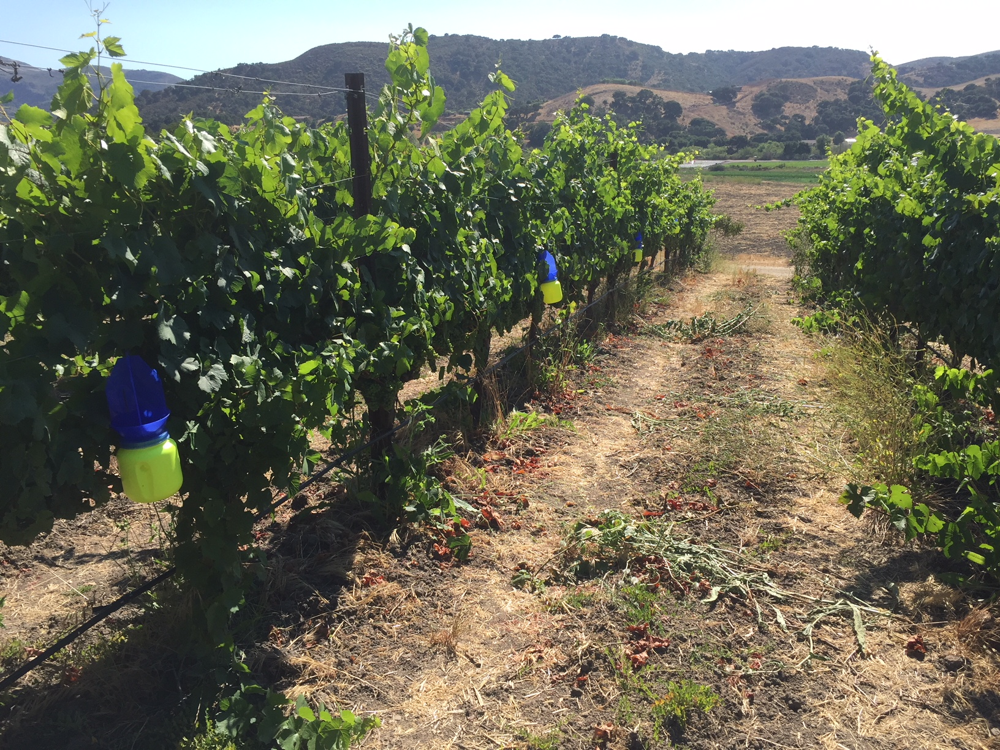

ampelos
================


how does a 'natural' field margin influence the population of beneficial insects?
---------------------------------------------------------------------------------

``` r
source("./code/bug-library.R")
source("./code/similarity.R")
source("./code/jaccard-similarity.R")
source("./code/diversity.R")
source("./code/k-means.R")

source.url <- c("https://raw.githubusercontent.com/cordphelps/ampelos/master/data/bugs.csv")
bugs.df <- read.csv(source.url, header=TRUE, row.names=NULL)
```

weekly composition of species and individuals?
----------------------------------------------

#### TO-DO: annotate charts with key dates ( spray events, cover crop collapse, veraision, )

``` r
# (fig.keep='none' suppresses the plots temporarily)

ggC <- div(bugs.df, species=FALSE, ignoreBees=FALSE, t="control")
ggO <- div(bugs.df, species=FALSE, ignoreBees=FALSE, t="oakMargin")

ggC2 <- div(bugs.df, species=TRUE, ignoreBees=FALSE, t="control")
ggO2 <- div(bugs.df, species=TRUE, ignoreBees=FALSE, t="oakMargin")
```

``` r
grid.arrange(ggO2, ggC2, ncol=2, nrow=1)
```


``` r
grid.arrange(ggO, ggC, ncol=2, nrow=1)
```


each of the two transects consists of 3 rows of 10 traps in each row. Is the total insect population relatively uniform among the 3 rows of a transect? Does this uniformity change over time? Compute the Jaccard Index for each week: the index *'is a statistic used for comparing the similarity and diversity of sample sets.'*
------------------------------------------------------------------------------------------------------------------------------------------------------------------------------------------------------------------------------------------------------------------------------------------------------------------------------------

#### Note that *'... the SMC counts both mutual presences (when an attribute is present in both sets) and mutual absence (when an attribute is absent in both sets) as matches and compares it to the total number of attributes in the universe, whereas the Jaccard index only counts mutual presence as matches and compares it to the number of attributes that have been chosen by at least one of the two sets.'* (<https://en.wikipedia.org/wiki/Jaccard_index>)

``` r
library(dplyr)

gOak <- compareJaccardMultiWeekV4(data=bugs.df, ignoreBees=TRUE,
                                  t="oakMargin",
                                  transectText="oakMargin")
```


``` r
gControl <- compareJaccardMultiWeekV4(data=bugs.df, ignoreBees=TRUE,
                                  t="control",
                                  transectText="control")
```


``` r
g <- arrangeGrob(gOak, gControl, nrow=2)
```

is there a difference in the spider populations for the two transects?
----------------------------------------------------------------------

``` r
reducedData.df <- selectDataAcrossTransects(data=bugs.df, week=quo(24), species=quo(Thomisidae..crab.spider.))

g24 <- plotBugDistribution(data=reducedData.df, 
                          title=paste("crab spider occurrences", "\nweek 24", sep=""), 
                          caption="stuff")
```


``` r
reducedData.df <- selectDataAcrossTransects(data=bugs.df, week=quo(30), species=quo(Thomisidae..crab.spider.))

g30 <- plotBugDistribution(data=reducedData.df, 
                          title=paste("crab spider occurrences", "\nweek 30", sep=""), 
                          caption="stuff")
```


``` r
# g <- arrangeGrob(g1, g2, nrow=1)
```

are clusters appearing and do they persist across multiple weeks?
-----------------------------------------------------------------

``` r
clusterNumber <- 3
df <- bugs.df
species <- "Thomisidae..crab.spider."

dataList <- buildClustersByWeek(df, t="control", species="Thomisidae..crab.spider.", cn=clusterNumber)

cl1.gg <- kmPlot(list=dataList, transectText="control")

dataList <- buildClustersByWeek(df, t="oakMargin", species="Thomisidae..crab.spider.", cn=clusterNumber)

cl2.gg <- kmPlot(list=dataList, transectText="oakMargin")
```

``` r
grid.arrange(cl1.gg, cl2.gg, ncol=2, nrow=1)
```


using the control transect as a baseline, how do the populations in the primary transect segments compare over time? (cluster analysis suggests trap segments 1-4, 5-7, and 8-10)
---------------------------------------------------------------------------------------------------------------------------------------------------------------------------------

#### TO-DO: refine normalization method

``` r
positionText <- paste("\ntransect positions ", "1-4", sep="")
g3 <- compareTransectUsingQuosure(data=bugs.df, 
                                 species=quo(Thomisidae..crab.spider.), 
                                 operator="LT",
                                 initialPosition=quo(5), 
                                 secondaryPosition=quo(0),
                                 positionText)
```


``` r
positionText <- paste("\ntransect positions ", "5-7", sep="")
g46 <- compareTransectUsingQuosure(data=bugs.df, 
                                 species=quo(Thomisidae..crab.spider.), 
                                 operator="BETWEEN",
                                 initialPosition=quo(4), 
                                 secondaryPosition=quo(8),
                                 positionText)
```


``` r
positionText <- paste("\ntransect positions ", "8-10", sep="")
g7 <- compareTransectUsingQuosure(data=bugs.df, 
                                 species=quo(Thomisidae..crab.spider.), 
                                 operator="GT",
                                 initialPosition=quo(7), 
                                 secondaryPosition=quo(0),
                                 positionText)
```


``` r
g <- arrangeGrob(g3, g46, g7, nrow=3)
newFile <- paste("ampelos-", format(Sys.time(), "%d-%m-%Y-%H%M"), ".pdf", sep = "")
ggsave(file=newFile, g, width=20, height=30, device = "pdf", units = "cm") #saves g
```

how about the insect populations themselves? Is the presence of any particular species correlated with the presence of a different species?
-------------------------------------------------------------------------------------------------------------------------------------------

``` r
m1 <- simMatrixV3(data=bugs.df, transect=quo("oakMargin"),
                                transectText="oakMargin")
```


``` r
#g <- arrangeGrob(m1, m2, nrow=2)
```

``` r
m2 <- simMatrixV3(data=bugs.df, transect=quo("control"),
                                transectText="control")
```


``` r
#g <- arrangeGrob(m1, m2, nrow=2)
```

does the crab spider population appear to change over time? Is there a difference between the two transects?
------------------------------------------------------------------------------------------------------------

``` r
# pass variables to dyplr pipes
# https://stackoverflow.com/questions/27975124/pass-arguments-to-dplyr-functions
#plotSpeciesTrend(data=bugs.df, bugs=quo(Thomisidae..crab.spider.), #speciesText="Crab Spider", where="control", when="pm", #caption=Sys.Date())

plotSpeciesTrendV2(data=bugs.df, bugs=quo(Thomisidae..crab.spider.), speciesText="Crab Spider", where="control", when="pm", caption=Sys.Date())
```



    ## NULL

the crab spider is a dominant species in the vineyard. How are they distributed along the length of the row?
------------------------------------------------------------------------------------------------------------

TO-DO: develop and apply normalization method
---------------------------------------------

``` r
plotRidges(data=bugs.df, combined=FALSE, bugs="Thomisidae..crab.spider.", speciesText="Crab Spider", where="control", when="pm", wk=1, caption=Sys.Date())
```

    ## Scale for 'x' is already present. Adding another scale for 'x', which
    ## will replace the existing scale.

    ## Picking joint bandwidth of 27.8


``` r
new.df <- bugs.df %>% mutate(newColumn = ifelse(Thomisidae..crab.spider. > 0, 1, 0))
plotRidges(data=new.df, combined=TRUE, bugs="newColumn", speciesText="Crab Spider", where="control", when="pm", wk=1, caption=Sys.Date())
```

    ## Scale for 'x' is already present. Adding another scale for 'x', which
    ## will replace the existing scale.

    ## Picking joint bandwidth of 17


``` r
plotRidges(data=new.df, combined=TRUE, bugs="newColumn", speciesText="Crab Spider", where="oakMargin", when="pm", wk=1, caption=Sys.Date())
```

    ## Scale for 'x' is already present. Adding another scale for 'x', which
    ## will replace the existing scale.

    ## Picking joint bandwidth of 16.6



and the species counts?
-----------------------

<table>
<thead>
<tr>
<th style="text-align:left;">
</th>
<th style="text-align:right;">
count
</th>
<th style="text-align:right;">
percentage
</th>
</tr>
</thead>
<tbody>
<tr>
<td style="text-align:left;">
Diptera..Agromyzidae..leafminer..
</td>
<td style="text-align:right;">
880
</td>
<td style="text-align:right;">
19.20
</td>
</tr>
<tr>
<td style="text-align:left;">
Braconid.wasp
</td>
<td style="text-align:right;">
73
</td>
<td style="text-align:right;">
1.59
</td>
</tr>
<tr>
<td style="text-align:left;">
Halictus.sp....3.part..native.bee.
</td>
<td style="text-align:right;">
476
</td>
<td style="text-align:right;">
10.39
</td>
</tr>
<tr>
<td style="text-align:left;">
pencilBug
</td>
<td style="text-align:right;">
60
</td>
<td style="text-align:right;">
1.31
</td>
</tr>
<tr>
<td style="text-align:left;">
Agapostemon.sp....green..native.bee.
</td>
<td style="text-align:right;">
77
</td>
<td style="text-align:right;">
1.68
</td>
</tr>
<tr>
<td style="text-align:left;">
Osmia.sp...native.bee.
</td>
<td style="text-align:right;">
62
</td>
<td style="text-align:right;">
1.35
</td>
</tr>
<tr>
<td style="text-align:left;">
Honey.Bee
</td>
<td style="text-align:right;">
471
</td>
<td style="text-align:right;">
10.28
</td>
</tr>
<tr>
<td style="text-align:left;">
Bombus.californicus..bumble.
</td>
<td style="text-align:right;">
277
</td>
<td style="text-align:right;">
6.04
</td>
</tr>
<tr>
<td style="text-align:left;">
Thomisidae..crab.spider.
</td>
<td style="text-align:right;">
678
</td>
<td style="text-align:right;">
14.79
</td>
</tr>
<tr>
<td style="text-align:left;">
spider.other
</td>
<td style="text-align:right;">
168
</td>
<td style="text-align:right;">
3.67
</td>
</tr>
<tr>
<td style="text-align:left;">
ladyBug
</td>
<td style="text-align:right;">
42
</td>
<td style="text-align:right;">
0.92
</td>
</tr>
<tr>
<td style="text-align:left;">
Lygus.hesperus..western.tarnished.plant.bug.
</td>
<td style="text-align:right;">
37
</td>
<td style="text-align:right;">
0.81
</td>
</tr>
<tr>
<td style="text-align:left;">
pentamonidae...stinkBug.
</td>
<td style="text-align:right;">
15
</td>
<td style="text-align:right;">
0.33
</td>
</tr>
<tr>
<td style="text-align:left;">
other
</td>
<td style="text-align:right;">
1197
</td>
<td style="text-align:right;">
26.12
</td>
</tr>
<tr>
<td style="text-align:left;">
checkerspot.butterfly
</td>
<td style="text-align:right;">
27
</td>
<td style="text-align:right;">
0.59
</td>
</tr>
<tr>
<td style="text-align:left;">
Pyralidae..Snout.Moth.
</td>
<td style="text-align:right;">
16
</td>
<td style="text-align:right;">
0.35
</td>
</tr>
<tr>
<td style="text-align:left;">
Diabrotica.undecimpunctata..Cucumber.Beetle.
</td>
<td style="text-align:right;">
18
</td>
<td style="text-align:right;">
0.39
</td>
</tr>
<tr>
<td style="text-align:left;">
Orius..pirate.bug.
</td>
<td style="text-align:right;">
9
</td>
<td style="text-align:right;">
0.20
</td>
</tr>
</tbody>
</table>
bottom of the Oak Transect; bird repellant streamers indicating the prevailing wind direction
---------------------------------------------------------------------------------------------


top of the Control Transect
---------------------------


bottom of the Control Transect with bird repellant streamers
------------------------------------------------------------


typical trap positioning; bowl in the fruit zone, vanes intersecting the canopy
-------------------------------------------------------------------------------


example trap sequence
---------------------


