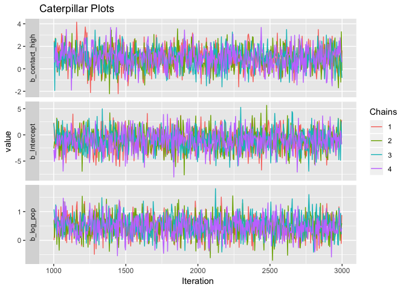
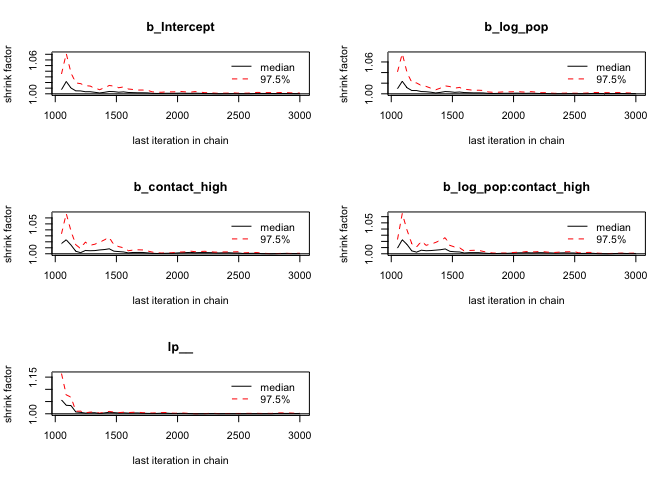
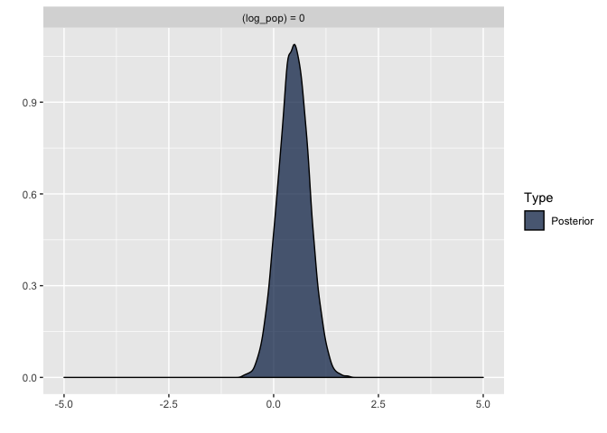
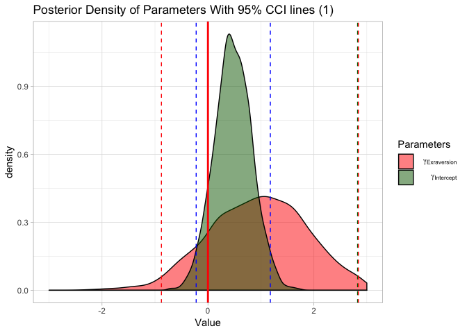

ampelos model check
================

``` r
# build the likelihood data : generateLikelihoodV2() 
returnList <- evaluateDailySpiderCounts(bugs.df)
```

    ## Scale for 'y' is already present. Adding another scale for 'y', which
    ## will replace the existing scale.
    ## Scale for 'y' is already present. Adding another scale for 'y', which
    ## will replace the existing scale.
    ## Scale for 'y' is already present. Adding another scale for 'y', which
    ## will replace the existing scale.

``` r
# returnList[[4]] is the data 'dataframe' used for the graphics (total.df)
# from bayes.R evaluateDailySpiderCounts()

rl <- returnList
## rl[[4]] is multiple records per week with columns
## week, transect, time, cluster, totalSpiders

filtered.df <- rl[[4]] %>% dplyr::filter(time == 'pm')
models.list <- generateLikelihoodV2models(df=filtered.df, inboundList=rl, daytime='pm')
```

``` r
# ref: https://www.rensvandeschoot.com/brms-wambs/
# BRMS Tutorial: Applying the WAMBS – checklist
#

library(brms)
```

    ## Loading required package: Rcpp

    ## Loading 'brms' package (version 2.6.0). Useful instructions
    ## can be found by typing help('brms'). A more detailed introduction
    ## to the package is available through vignette('brms_overview').
    ## Run theme_set(theme_default()) to use the default bayesplot theme.

``` r
library(ggmcmc)
library(mcmcplots) 
```

    ## Loading required package: coda

``` r
get_prior(b_Intercept ~ 1 + b_log_pop + b_contact_high + b_contact_high:b_log_pop, data=as.data.frame(models.list[[1]]))
```

                 prior     class                     coef group resp dpar

1 b
2 b b\_contact\_high
3 b b\_log\_pop
4 b b\_log\_<pop:b_contact_high>
5 student\_t(3, -1, 10) Intercept
6 student\_t(3, 0, 10) sigma
nlpar bound 1
2
3
4
5
6

``` r
# l2. Does the trace-plot exhibit convergence?

modeltranformed<-ggs(models.list[[1]]) # the ggs function transforms the BRMS output into a longformat tibble, that we can use to make different types of plots.

ggplot(filter(modeltranformed, Parameter==c("b_Intercept", "b_log_pop", "b_contact_high", "b_log_pop:b_contact_high"), Iteration>1000), aes(x=Iteration, y=value, col=as.factor(Chain))) +
  geom_line() +
  facet_grid(Parameter ~ .,scale='free_y',switch = 'y') +
  labs(title="Caterpillar Plots", col= "Chains")
```



``` r
# To obtain convergence diagnostics to check convergence for the parameters of interest we use the Gelman and Rubin diagnostic (Gelman and Rubin 1992) and the Geweke (1992) diagnostic.

modelposterior<-as.mcmc(models.list[[1]]) # with the as.mcmc() command we can use all the CODA package convergence statistics and plotting options
gelman.diag(modelposterior[, 1:5])
```

Potential scale reduction factors:

                       Point est. Upper C.I.

b\_Intercept 1 1 b\_log\_pop 1 1 b\_contact\_high 1 1 b\_log\_<pop:contact_high> 1 1 lp\_\_ 1 1

Multivariate psrf

1

``` r
gelman.plot(modelposterior[, 1:5])
```



``` r
# 4. Does the posterior distribution histogram have enough information?

plot(hypothesis(models.list[[1]], "log_pop = 0"), plot = F, theme = theme_get())[[1]]+ scale_x_continuous(limits=c(-5, 5))
```



``` r
# 5. Do the chains exhibit a strong degree of autocorrelation?

autocorr.diag(modelposterior[,1:5], lags = c(0, 1,2,3,4, 5, 10, 50))
```

       b_Intercept   b_log_pop b_contact_high b_log_pop:contact_high

Lag 0 1.00000000 1.00000000 1.00000000 1.00000000 Lag 1 0.20948291 0.20673206 0.39640883 0.38740835 Lag 2 0.04840750 0.04651513 0.15559129 0.15138748 Lag 3 0.01492989 0.01447169 0.05767245 0.06092794 Lag 4 -0.01038130 -0.00965776 0.03486184 0.03161829 Lag 5 -0.01356478 -0.01326350 0.01462528 0.00948225 Lag 10 -0.01034584 -0.01156125 -0.01366971 -0.01162369 Lag 50 -0.02080003 -0.02033323 0.01378933 0.01572530 lp\_\_ Lag 0 1.000000000 Lag 1 0.427174241 Lag 2 0.178252529 Lag 3 0.066674817 Lag 4 0.012932122 Lag 5 0.002477748 Lag 10 0.002496130 Lag 50 -0.013206321

``` r
# 6. Do the posterior distributions make substantive sense?

model <- models.list[[1]]

ggplot(filter(modeltranformed, Parameter==c("b_log_pop","b_contact_high"), Iteration>1000), aes(x=value, fill=Parameter)) +
  geom_density(alpha=.5) +
  geom_vline(xintercept = 0, col="red", size=1) +
  scale_x_continuous(name="Value", limits=c(-3, 3)) + 
    geom_vline(xintercept = summary(model)$fixed[1,3:4], col="darkgreen", linetype=2) +
    geom_vline(xintercept = summary(model)$fixed[2,3:4], col="blue", linetype=2) +
    geom_vline(xintercept = summary(model)$fixed[3,3:4], col="red", linetype=2) +
  theme_light() +
   scale_fill_manual(name='Parameters', values = c("red","darkgreen" , "lightblue"), labels=c(expression( " "  ~  gamma[Exraversion]), expression( " "  ~  gamma[Intercept]),  expression( " "  ~  gamma[Sex]))) +
  labs(title="Posterior Density of Parameters With 95% CCI lines (1)")
```

    ## Warning: Removed 66 rows containing non-finite values (stat_density).

    ## Warning: Removed 1 rows containing missing values (geom_vline).



``` r
# 10. Is the Bayesian way of interpreting and reporting model results used?

# For a summary on how to interpret and report models, please refer to https://www.rensvandeschoot.com/bayesian-analyses-where-to-start-and-what-to-report/

summary(model)
```

Family: poisson Links: mu = log Formula: totalSpiders ~ 1 + log\_pop + contact\_high + contact\_high:log\_pop Data: cl.st.list\[\[i\]\] (Number of observations: 18) Samples: 4 chains, each with iter = 3000; warmup = 1000; thin = 1; total post-warmup samples = 8000

Population-Level Effects: Estimate Est.Error l-95% CI u-95% CI Eff.Sample Rhat Intercept -1.04 1.99 -4.92 2.83 5163 1.00 log\_pop 0.48 0.36 -0.22 1.18 5199 1.00 contact\_high 0.97 0.95 -0.88 2.84 3422 1.00 log\_<pop:contact_high> -0.16 0.18 -0.50 0.18 3485 1.00

Samples were drawn using sampling(NUTS). For each parameter, Eff.Sample is a crude measure of effective sample size, and Rhat is the potential scale reduction factor on split chains (at convergence, Rhat = 1).

``` r
# long text tables

# "column spec"
# https://cran.r-project.org/web/packages/kableExtra/vignettes/awesome_table_in_html.html
```
