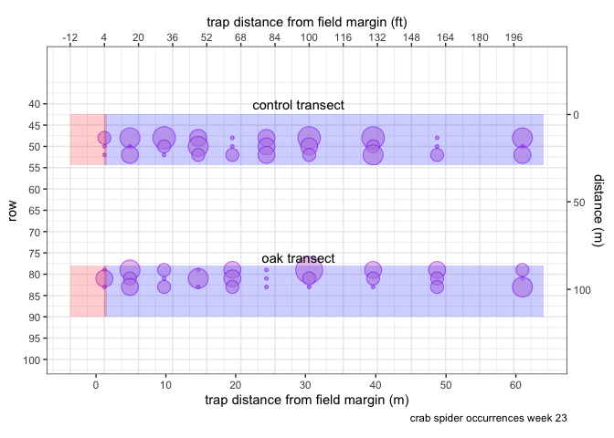
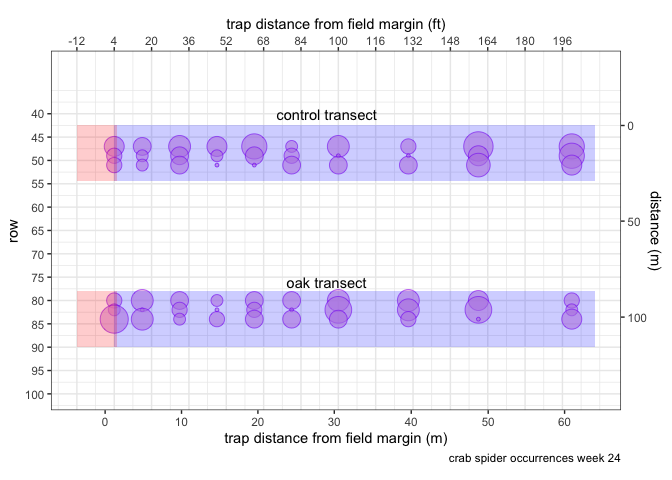
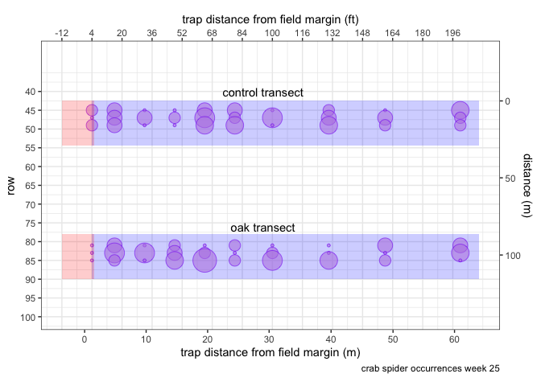
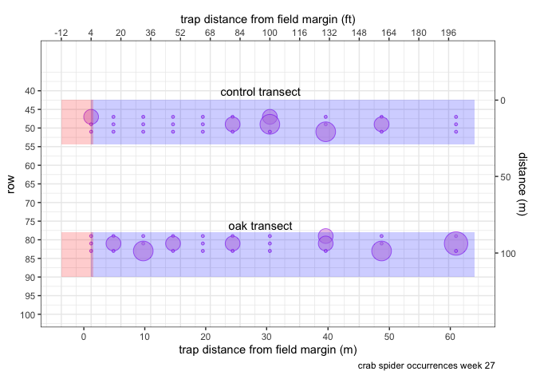
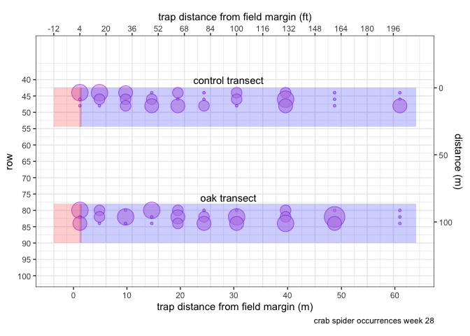
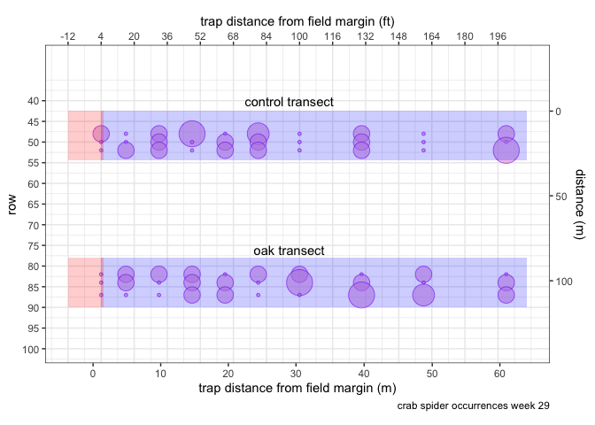
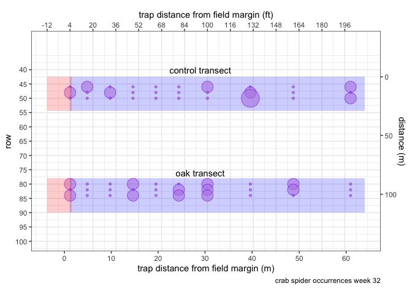
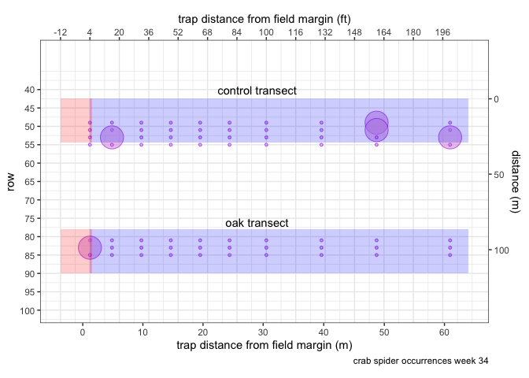

ampelos
================

``` r
source("./code/bug-library.R")
source("./code/similarity.R")
source("./code/jaccard-similarity.R")
source("./code/diversity.R")
source("./code/k-means.R")
source("./code/clusterSimilarity.R")
source('./code/bayes.R')
source('./code/ranking.R')

# library(ampelos)   <-- failed replacement for sample.int, 
# see bayes.R likelihoodPlusModelDiags()

source.url <- c("https://raw.githubusercontent.com/cordphelps/ampelos/master/data/bugs.csv")
bugs.df <- read.csv(source.url, header=TRUE, row.names=NULL)

# setwd("./code/thesis/ampelos/")
```

``` r
weeks.vector <- getWeeks(bugs.df)

for (i in 1:length(weeks.vector)) {
  reducedData.df <- selectDataAcrossTransects(data=bugs.df, week=quo(weeks.vector[[i]]), species=quo(Thomisidae..crab.spider.))

  g24 <- plotBugDistribution(data=reducedData.df, 
                          cap=paste("crab spider occurrences", " week ", weeks.vector[[i]], sep=""))
  
  print(g24)
  
}
```



    ## TableGrob (1 x 1) "arrange": 1 grobs
    ##   z     cells    name           grob
    ## 1 1 (1-1,1-1) arrange gtable[layout]



    ## TableGrob (1 x 1) "arrange": 1 grobs
    ##   z     cells    name           grob
    ## 1 1 (1-1,1-1) arrange gtable[layout]



    ## TableGrob (1 x 1) "arrange": 1 grobs
    ##   z     cells    name           grob
    ## 1 1 (1-1,1-1) arrange gtable[layout]


    ## TableGrob (1 x 1) "arrange": 1 grobs
    ##   z     cells    name           grob
    ## 1 1 (1-1,1-1) arrange gtable[layout]



    ## TableGrob (1 x 1) "arrange": 1 grobs
    ##   z     cells    name           grob
    ## 1 1 (1-1,1-1) arrange gtable[layout]



    ## TableGrob (1 x 1) "arrange": 1 grobs
    ##   z     cells    name           grob
    ## 1 1 (1-1,1-1) arrange gtable[layout]



    ## TableGrob (1 x 1) "arrange": 1 grobs
    ##   z     cells    name           grob
    ## 1 1 (1-1,1-1) arrange gtable[layout]


    ## TableGrob (1 x 1) "arrange": 1 grobs
    ##   z     cells    name           grob
    ## 1 1 (1-1,1-1) arrange gtable[layout]


    ## TableGrob (1 x 1) "arrange": 1 grobs
    ##   z     cells    name           grob
    ## 1 1 (1-1,1-1) arrange gtable[layout]



    ## TableGrob (1 x 1) "arrange": 1 grobs
    ##   z     cells    name           grob
    ## 1 1 (1-1,1-1) arrange gtable[layout]



    ## TableGrob (1 x 1) "arrange": 1 grobs
    ##   z     cells    name           grob
    ## 1 1 (1-1,1-1) arrange gtable[layout]
