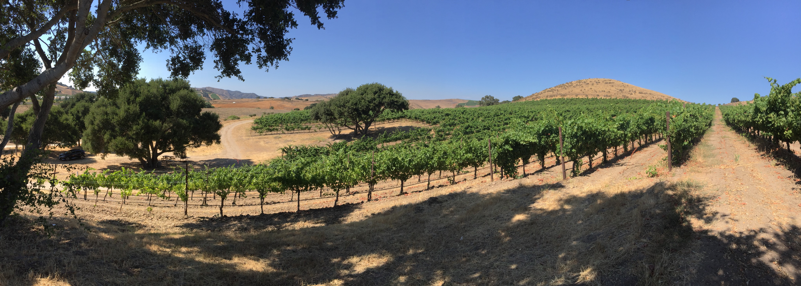
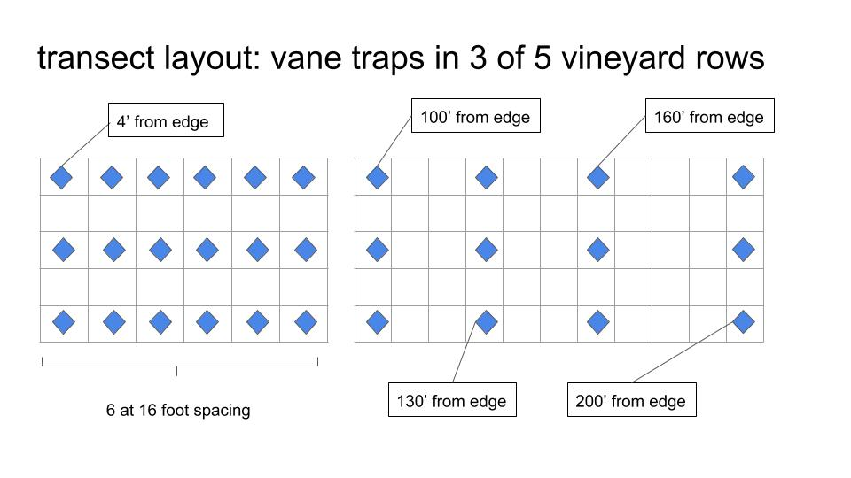
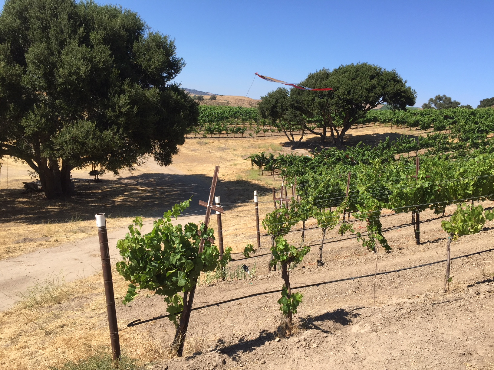
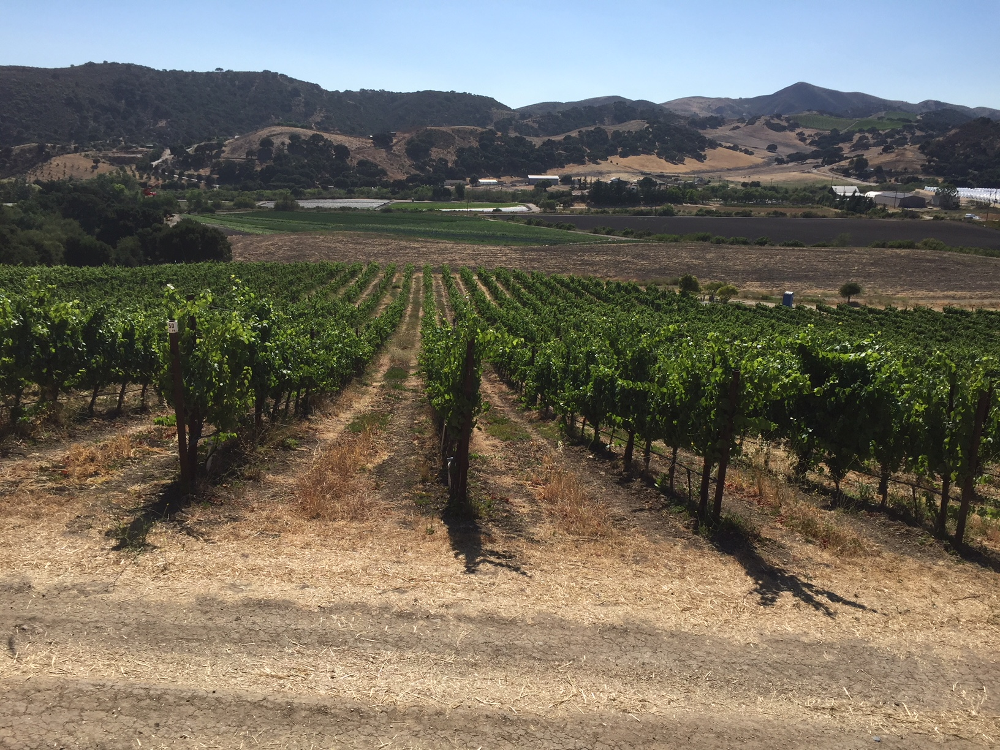
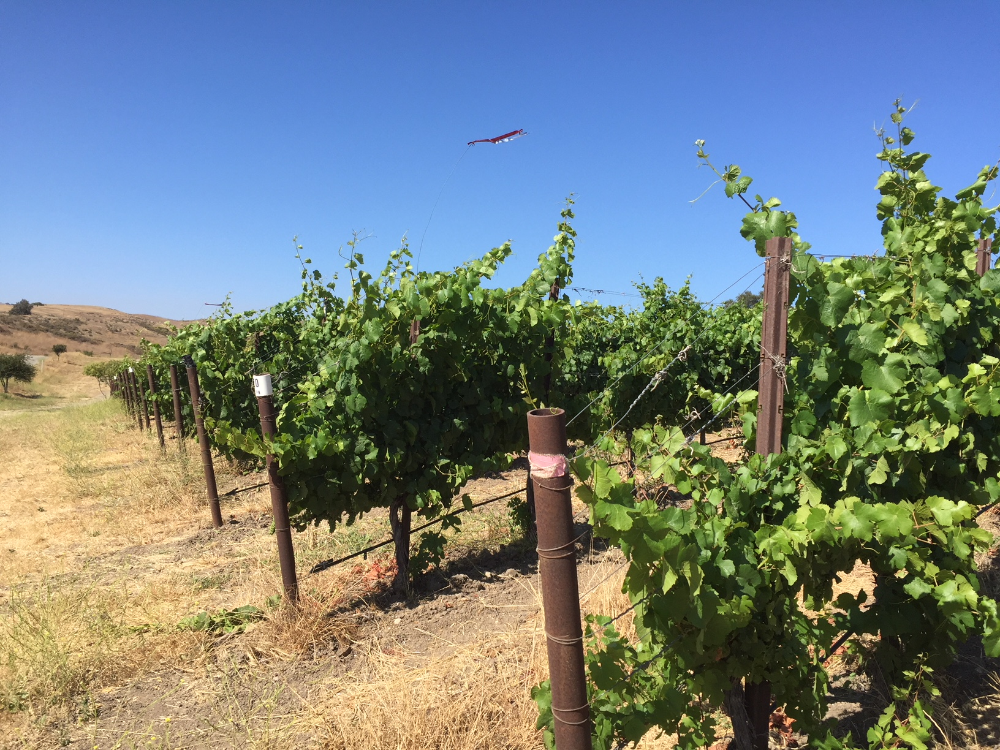
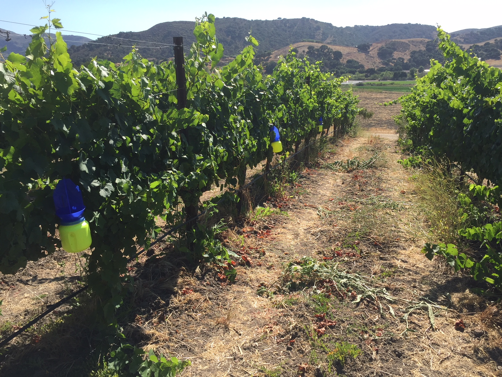

## how does a 'natural habitat' field margin influence the population of beneficial insects in an organic vineyard?


```{r setup, echo=T, message=F, warning=F}

source("./code/bug-library.R")
source("./code/similarity.R")
source("./code/jaccard-similarity.R")
source("./code/diversity.R")
source("./code/k-means.R")
source("./code/clusterSimilarity.R")
source('./code/bayes.R')

source.url <- c("https://raw.githubusercontent.com/cordphelps/ampelos/master/data/bugs.csv")
bugs.df <- read.csv(source.url, header=TRUE, row.names=NULL)


```

### weekly composition of species and individuals?

#### TO-DO: annotate charts with key dates ( spray events, cover crop collapse, veraision, )

```{r diversity, echo=TRUE, include=FALSE, message=F, warning=F, fig.keep='none'}

# (fig.keep='none' suppresses the plots temporarily)

gg.Ind.joint <- divV2(bugs.df, species=FALSE, ignoreBees=FALSE)
gg.Species.joint <- divV2(bugs.df, species=TRUE, ignoreBees=FALSE)

```

```{r diversityArrange, echo=TRUE, include=TRUE, message=F, warning=F}

#grid.arrange(ggO, ggC, ncol=1, nrow=2)
#ggsave("./code/output/diversity2.png", plot=grid.arrange(ggO, ggC, ncol=1, nrow=2), width = 6, height = 4, units = "in")

grid.arrange(gg.Species.joint, gg.Ind.joint, ncol=1, nrow=2)

```





### each of the two transects consists of 3 rows of 10 traps in each row. Is the total insect population relatively uniform among the 3 rows of a transect? Does this uniformity change over time? Compute the Jaccard Index for each week: the index *'is a statistic used for comparing the similarity and diversity of sample sets.'* 

##### Note that *'... the SMC counts both mutual presences (when an attribute is present in both sets) and mutual absence (when an attribute is absent in both sets) as matches and compares it to the total number of attributes in the universe, whereas the Jaccard index only counts mutual presence as matches and compares it to the number of attributes that have been chosen by at least one of the two sets.'* (https://en.wikipedia.org/wiki/Jaccard_index)


```{r similarity, echo=TRUE, include=TRUE, message=F, warning=F }

library(dplyr)

gOak <- compareJaccardMultiWeekV4(data=bugs.df, ignoreBees=TRUE,
                                  t="oakMargin",
                                  transectText="oakMargin")

gControl <- compareJaccardMultiWeekV4(data=bugs.df, ignoreBees=TRUE,
                                  t="control",
                                  transectText="control")


```


### the crab spider is a dominant species in the vineyard. How are they distributed along the length of the row? 

#### TO-DO: develop and apply normalization method

```{r ridges, echo=TRUE, include=TRUE, message=F, warning=F}

new.df <- bugs.df %>% mutate(newColumn = ifelse(Thomisidae..crab.spider. > 0, 1, 0))

v2.1 <- plotRidgesV2(data=new.df, combined=TRUE, bugs="newColumn", speciesText="Crab Spider", when="pm", wk=1, caption=Sys.Date())

print(v2.1)

v2.2 <- plotRidgesV2(data=new.df, combined=TRUE, bugs="newColumn", speciesText="Crab Spider", when="am", wk=1, caption=Sys.Date())

print(v2.2)

```


### is there a difference in the spider populations for the two transects?


```{r overheadCompare, echo=TRUE, include=TRUE, message=F, warning=F}


reducedData.df <- selectDataAcrossTransects(data=bugs.df, week=quo(24), species=quo(Thomisidae..crab.spider.))

g24 <- plotBugDistribution(data=reducedData.df, 
                          title=paste("crab spider occurrences", "\nweek 24", sep=""), 
                          caption="stuff")


reducedData.df <- selectDataAcrossTransects(data=bugs.df, week=quo(30), species=quo(Thomisidae..crab.spider.))

g30 <- plotBugDistribution(data=reducedData.df, 
                          title=paste("crab spider occurrences", "\nweek 30", sep=""), 
                          caption="stuff")


# g <- arrangeGrob(g1, g2, nrow=1)

```

### are clusters appearing and do they persist across multiple weeks?

```{r overheadClusters, echo=T, include=T, message=F, warning=T, fig.keep='none'}


clusterNumber <- 3
df <- bugs.df
species <- "Thomisidae..crab.spider."

dataList <- buildClustersByWeek(df, t="control", species="Thomisidae..crab.spider.", cn=clusterNumber)

cl1.gg <- kmPlot(list=dataList, transectText="control")

dataList <- buildClustersByWeek(df, t="oakMargin", species="Thomisidae..crab.spider.", cn=clusterNumber)

cl2.gg <- kmPlot(list=dataList, transectText="oakMargin")


```


```{r clustersArrange, out.width = "100%", echo=TRUE, include=TRUE, message=F, warning=F}

grid.arrange(cl1.gg, cl2.gg, ncol=2, nrow=1)


```

#### (control cluster #2 is slightly wider than oakMargin cluster #2)


### How plausible is it that an oakMargin transect row will have more spiders than a control transect row?

```{r clusterBayes, echo=TRUE, include=TRUE, results="hide", message=F, warning=F}

if (TRUE) {
  #source('./code/bayes.R')

  returnList <- evaluateDailySpiderCounts(bugs.df)

  lh.df <- returnList[[5]]

  returnList[[6]] <- plotLikelihood(df=lh.df)

  print(returnList[[1]])
  print(returnList[[6]])

  # kruskal.test(likelihood ~ seasonalTimeframe, data = lh.df)

  # pairwise.wilcox.test(lh.df$likelihood, lh.df$seasonalTimeframe,
     #                     p.adjust.method = "BH")

  
}


```


```{r kable1, results='asis', echo=FALSE, message=F, warning=F}

knitr::kable(returnList[[5]])

```


### how do the clusters compare to each other across multiple weeks?

```{r clusterBoxPlots, echo=TRUE, include=TRUE, message=F, warning=F }

# strip out the other arthropods and misc stuff
input.df <- clusterSetup()

# for each 'position', get spiders and assign to a cluster number

#   !!!!!!!! function can't handle "both" !!!!!!!!!!!!!!
#cluster.df <- clusterAccumulateTotal(df, "control", "both")
#clusterBoxplot(cluster.df, "control", "(24 hours)")


#cluster.df <- clusterAccumulateTotal(df, "oakMargin", "both")
#clusterBoxplot(cluster.df, "oakMargin", "(24 hours)")


cluster.df <- clusterAccumulate(df=input.df, t="control", daytime="pm")
  #> cluster.df
  # A tibble: 110 x 3
  #    week spiders cluster
  #   <int>   <int> <chr>  
 #1    23       1 cl1    
 #2    24       8 cl1    
 #3    25       1 cl1    
 #4    26       1 cl1    
 #5    27       1 cl1
clusterBoxplot(cluster.df, "control", "pm")

temp.df <- clusterStats(df=input.df, t="control", daytime="pm")
#> temp.df
#   transect time cluster week       mean        sd normalMean  normalSD distanceTenX
#1   control   pm     cl1   34 0.03703704 0.1924501 0.02941176 0.1538812     1.566667
#2   control   pm     cl1   32 0.03703704 0.1924501 0.02941176 0.1538812     1.566667
#3   control   pm     cl1   31 0.00000000 0.0000000 0.00000000 0.0000000     0.000000
#4   control   pm     cl1   30 0.03703704 0.1924501 0.02941176 0.1538812     1.566667
#5   co

#head(temp.df)

rankControlPM.df <- rankByWeek(df=temp.df)
# > rankControlPM.df
#   week first second third
#1    23   cl2    cl3   cl1
#2    24   cl3    cl1   cl2
#3    25   cl2    cl3   cl1
#4    26   cl2    cl3   cl1
#5    27   cl2    cl1   cl3
bubbleClusterRanks(rankControlPM.df, "control", "pm")


cluster.df <- clusterAccumulate(df=input.df, t="oakMargin", daytime="pm")
clusterBoxplot(cluster.df, "oakMargin", "pm")
temp.df <- clusterStats(df=input.df, t="oakMargin", daytime="pm")
#head(temp.df)
rankOakPM.df <- rankByWeek(df=temp.df)
bubbleClusterRanks(rankOakPM.df, "oakMargin", "pm")

cluster.df <- clusterAccumulate(df=input.df, "control", "am")
clusterBoxplot(cluster.df, "control", "am")
temp.df <- clusterStats(df=input.df, t="control", daytime="am")
#head(temp.df)
rankControlAM.df <- rankByWeek(df=temp.df)
bubbleClusterRanks(rankControlAM.df, "control", "am")

cluster.df <- clusterAccumulate(df=input.df, "oakMargin", "am")
clusterBoxplot(cluster.df, "oakMargin", "am")
temp.df <- clusterStats(df=input.df, t="oakMargin", daytime="am")
#head(temp.df)
rankOakAM.df <- rankByWeek(df=temp.df)
bubbleClusterRanks(rankOakPM.df, "oakMargin", "am")


```


### does the crab spider population appear to change over time? Is there a difference between the two transects?

```{r population-trends, echo=TRUE, include=TRUE, message=F, warning=F}

plotSpeciesTrendV3(data=bugs.df, species=quo(Thomisidae..crab.spider.), period="am", trend=TRUE, speciesText="Crab Spider", lowerWeekLimit=23, upperWeekLimit=34, caption=Sys.Date())

plotSpeciesTrendV3(data=bugs.df, species=quo(Thomisidae..crab.spider.), period="am", trend=FALSE, speciesText="Crab Spider", lowerWeekLimit=23, upperWeekLimit=34, caption=Sys.Date())

plotSpeciesTrendV3(data=bugs.df, species=quo(Thomisidae..crab.spider.), period="pm", trend=TRUE, speciesText="Crab Spider", lowerWeekLimit=23, upperWeekLimit=34, caption=Sys.Date())

plotSpeciesTrendV3(data=bugs.df, species=quo(Thomisidae..crab.spider.), period="pm", trend=FALSE, speciesText="Crab Spider", lowerWeekLimit=23, upperWeekLimit=34, caption=Sys.Date())

plotSpeciesTrendV3(data=bugs.df, species=quo(Thomisidae..crab.spider.), period="both", trend=TRUE, speciesText="Crab Spider", lowerWeekLimit=23, upperWeekLimit=34, caption=Sys.Date())

plotSpeciesTrendV3(data=bugs.df, species=quo(Thomisidae..crab.spider.), period="both", trend=FALSE, speciesText="Crab Spider", lowerWeekLimit=23, upperWeekLimit=34, caption=Sys.Date())

```


### and the species counts?

```{r kable2, results='asis', echo=FALSE, message=F, warning=F}

bugList <- colnames(bugs.df[,5:22])
trim.tbl <- bugs.df %>% select(5:22) %>% colSums() %>% t()
# https://stackoverflow.com/questions/9623763/in-r-how-can-i-compute-percentage-statistics-on-a-column-in-a-dataframe-tabl
#trim.tbl <- table(trim.df)
trim.tbl <- t(trim.tbl)
trim.tbl <- cbind(trim.tbl,round(prop.table(trim.tbl)*100,2))
colnames(trim.tbl) <- c('count','percentage')

knitr::kable(trim.tbl)


```


### how about the insect populations themselves? Is the presence of any particular species correlated with the presence of a different species?

```{r speciesMatrixOak, out.width = "100%", echo=TRUE, include=TRUE, message=F, warning=F }

m1 <- simMatrixV3(data=bugs.df, transect=quo("oakMargin"),
                                transectText="oakMargin")

#g <- arrangeGrob(m1, m2, nrow=2)

```


```{r speciesMatrixControl, out.width = "100%", echo=TRUE, include=TRUE, message=F, warning=F }


m2 <- simMatrixV3(data=bugs.df, transect=quo("control"),
                                transectText="control")

#g <- arrangeGrob(m1, m2, nrow=2)

```


### bottom of the Oak Transect; bird repellant streamers indicating the prevailing wind direction



### top of the Control Transect



### bottom of the Control Transect with bird repellant streamers 



### typical trap positioning; bowl in the fruit zone, vanes intersecting the canopy


### example trap sequence




