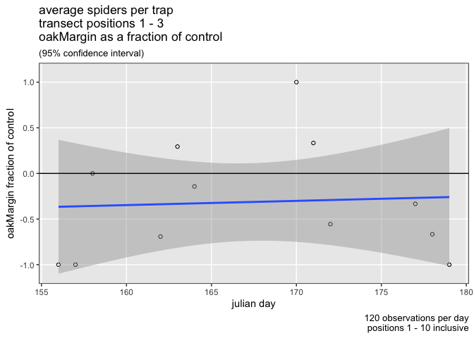
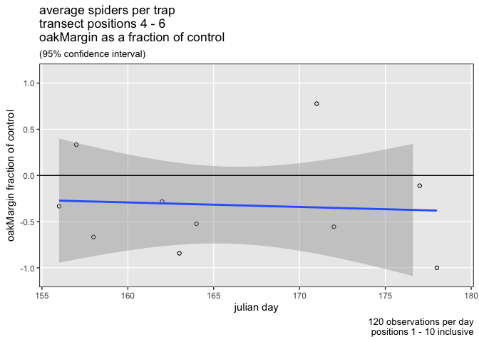
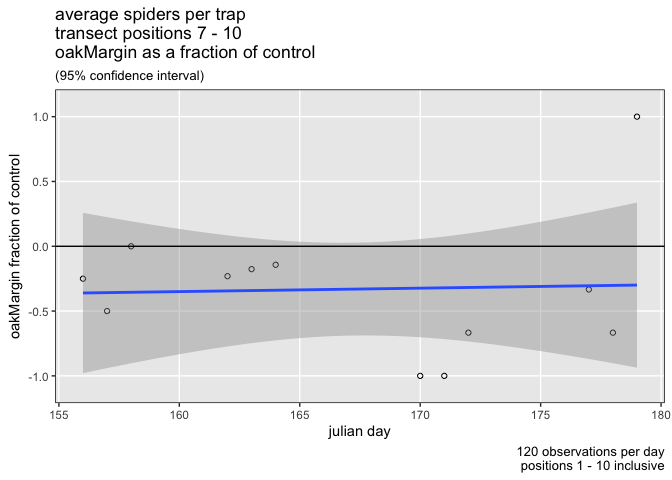
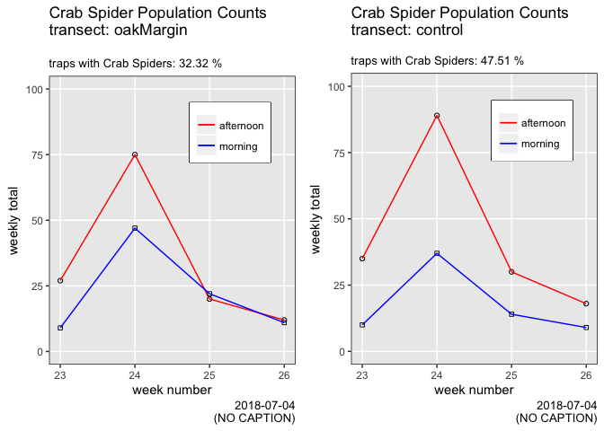
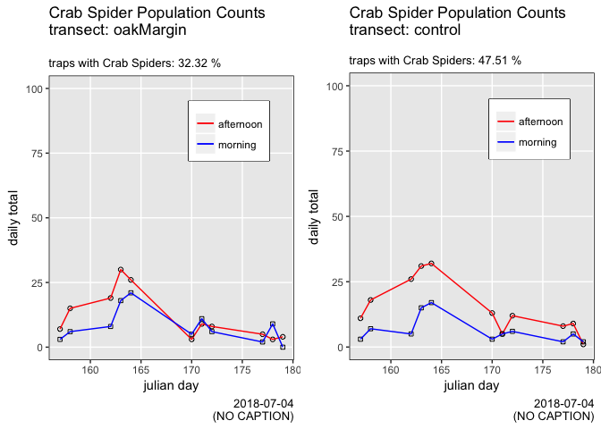

ampelos
================

    ## ABC

    ## 
    ## Attaching package: 'dplyr'

    ## The following object is masked from 'package:gridExtra':
    ## 
    ##     combine

    ## The following objects are masked from 'package:stats':
    ## 
    ##     filter, lag

    ## The following objects are masked from 'package:base':
    ## 
    ##     intersect, setdiff, setequal, union

    ## ── Attaching packages ──────────────────────────────────────────────────────── tidyverse 1.2.1 ──

    ## ✔ tibble  1.4.2     ✔ purrr   0.2.4
    ## ✔ tidyr   0.7.2     ✔ stringr 1.3.1
    ## ✔ readr   1.1.1     ✔ forcats 0.2.0

    ## ── Conflicts ─────────────────────────────────────────────────────────── tidyverse_conflicts() ──
    ## ✖ purrr::%@%()         masks rlang::%@%()
    ## ✖ purrr::%||%()        masks rlang::%||%()
    ## ✖ purrr::as_function() masks rlang::as_function()
    ## ✖ dplyr::combine()     masks gridExtra::combine()
    ## ✖ dplyr::filter()      masks stats::filter()
    ## ✖ purrr::flatten()     masks rlang::flatten()
    ## ✖ purrr::flatten_chr() masks rlang::flatten_chr()
    ## ✖ purrr::flatten_dbl() masks rlang::flatten_dbl()
    ## ✖ purrr::flatten_int() masks rlang::flatten_int()
    ## ✖ purrr::flatten_lgl() masks rlang::flatten_lgl()
    ## ✖ purrr::invoke()      masks rlang::invoke()
    ## ✖ dplyr::lag()         masks stats::lag()
    ## ✖ purrr::list_along()  masks rlang::list_along()
    ## ✖ purrr::modify()      masks rlang::modify()
    ## ✖ purrr::rep_along()   masks rlang::rep_along()
    ## ✖ purrr::splice()      masks rlang::splice()

    ## Scale for 'x' is already present. Adding another scale for 'x', which
    ## will replace the existing scale.

    ## Picking joint bandwidth of 29.1

    ## Scale for 'x' is already present. Adding another scale for 'x', which
    ## will replace the existing scale.

    ## Picking joint bandwidth of 19.6

    ## Scale for 'x' is already present. Adding another scale for 'x', which
    ## will replace the existing scale.

    ## Picking joint bandwidth of 19.9

    ## NULL

    ## [1] 490

<table>
<caption>
this is a caption
</caption>
<thead>
<tr>
<th style="text-align:right;">
total
</th>
<th style="text-align:right;">
new
</th>
</tr>
</thead>
<tbody>
<tr>
<td style="text-align:right;">
617
</td>
<td style="text-align:right;">
3085
</td>
</tr>
<tr>
<td style="text-align:right;">
24
</td>
<td style="text-align:right;">
120
</td>
</tr>
<tr>
<td style="text-align:right;">
159
</td>
<td style="text-align:right;">
795
</td>
</tr>
<tr>
<td style="text-align:right;">
40
</td>
<td style="text-align:right;">
200
</td>
</tr>
<tr>
<td style="text-align:right;">
26
</td>
<td style="text-align:right;">
130
</td>
</tr>
<tr>
<td style="text-align:right;">
58
</td>
<td style="text-align:right;">
290
</td>
</tr>
<tr>
<td style="text-align:right;">
248
</td>
<td style="text-align:right;">
1240
</td>
</tr>
<tr>
<td style="text-align:right;">
171
</td>
<td style="text-align:right;">
855
</td>
</tr>
<tr>
<td style="text-align:right;">
465
</td>
<td style="text-align:right;">
2325
</td>
</tr>
<tr>
<td style="text-align:right;">
36
</td>
<td style="text-align:right;">
180
</td>
</tr>
<tr>
<td style="text-align:right;">
15
</td>
<td style="text-align:right;">
75
</td>
</tr>
<tr>
<td style="text-align:right;">
26
</td>
<td style="text-align:right;">
130
</td>
</tr>
<tr>
<td style="text-align:right;">
9
</td>
<td style="text-align:right;">
45
</td>
</tr>
<tr>
<td style="text-align:right;">
439
</td>
<td style="text-align:right;">
2195
</td>
</tr>
<tr>
<td style="text-align:right;">
25
</td>
<td style="text-align:right;">
125
</td>
</tr>
<tr>
<td style="text-align:right;">
13
</td>
<td style="text-align:right;">
65
</td>
</tr>
<tr>
<td style="text-align:right;">
9
</td>
<td style="text-align:right;">
45
</td>
</tr>
<tr>
<td style="text-align:right;">
3
</td>
<td style="text-align:right;">
15
</td>
</tr>
<tr>
<td style="text-align:right;">
8
</td>
<td style="text-align:right;">
40
</td>
</tr>
<tr>
<td style="text-align:right;">
5
</td>
<td style="text-align:right;">
25
</td>
</tr>
<tr>
<td style="text-align:right;">
6
</td>
<td style="text-align:right;">
30
</td>
</tr>
<tr>
<td style="text-align:right;">
5
</td>
<td style="text-align:right;">
25
</td>
</tr>
<tr>
<td style="text-align:right;">
2
</td>
<td style="text-align:right;">
10
</td>
</tr>
<tr>
<td style="text-align:right;">
3
</td>
<td style="text-align:right;">
15
</td>
</tr>
<tr>
<td style="text-align:right;">
4
</td>
<td style="text-align:right;">
20
</td>
</tr>
<tr>
<td style="text-align:right;">
6
</td>
<td style="text-align:right;">
30
</td>
</tr>
<tr>
<td style="text-align:right;">
4
</td>
<td style="text-align:right;">
20
</td>
</tr>
<tr>
<td style="text-align:right;">
1
</td>
<td style="text-align:right;">
5
</td>
</tr>
<tr>
<td style="text-align:right;">
1
</td>
<td style="text-align:right;">
5
</td>
</tr>
<tr>
<td style="text-align:right;">
2
</td>
<td style="text-align:right;">
10
</td>
</tr>
<tr>
<td style="text-align:right;">
2
</td>
<td style="text-align:right;">
10
</td>
</tr>
<tr>
<td style="text-align:right;">
6
</td>
<td style="text-align:right;">
30
</td>
</tr>
<tr>
<td style="text-align:right;">
2
</td>
<td style="text-align:right;">
10
</td>
</tr>
<tr>
<td style="text-align:right;">
2
</td>
<td style="text-align:right;">
10
</td>
</tr>
<tr>
<td style="text-align:right;">
2
</td>
<td style="text-align:right;">
10
</td>
</tr>
<tr>
<td style="text-align:right;">
1
</td>
<td style="text-align:right;">
5
</td>
</tr>
</tbody>
</table>
