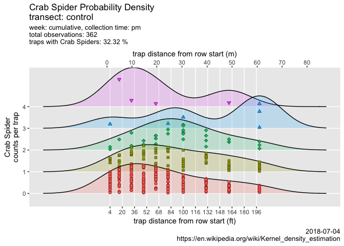
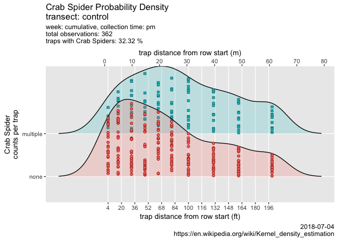
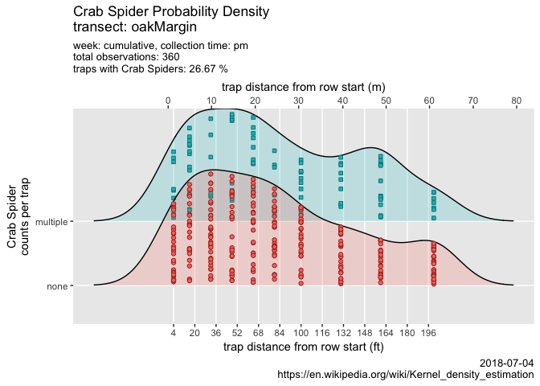

ampelos
================

``` r
# https://tex.stackexchange.com/questions/152488/suppress-library-comments-from-output-with-knitr

##################### QA #############################
# QA : bugs.df %>% dplyr::group_by(julian) %>% skim() 
# bugs.df %>% dplyr::filter(julian==158) %>% skim() 
# https://stackoverflow.com/questions/22353633/filter-for-complete-cases-in-data-frame-using-dplyr-case-wise-deletion
# bugs.df %>% dplyr::filter(complete.cases(.))
# bugs.df %>% dplyr::filter(!complete.cases(.))
######################################################


#setwd("./code/thesis/ampelos/")
source("./bug-library.R")

source.url <- c("https://raw.githubusercontent.com/cordphelps/ampelos/master/bugs.csv")
bugs.df <- read.csv(source.url, header=TRUE, row.names=NULL)

assign("bugs.df", bugs.df, envir=.GlobalEnv)

g <- compareTransect()
```


``` r
newFile <- paste("ampelos-", format(Sys.time(), "%d-%m-%Y-%H%M"), ".pdf", sep = "")
ggsave(file=newFile, g, width=20, height=30, device = "pdf", units = "cm") #saves g

# pass variables to dyplr pipes
# https://stackoverflow.com/questions/27975124/pass-arguments-to-dplyr-functions
plotSpeciesTrend(data=bugs.df, bugs=quo(Thomisidae..crab.spider.), speciesText="Crab Spider", where="control", when="pm", caption=Sys.Date())
```


    ## NULL

``` r
plotRidges(data=bugs.df, combined=FALSE, bugs="Thomisidae..crab.spider.", speciesText="Crab Spider", where="control", when="pm", wk=1, caption=Sys.Date())
```



``` r
new.df <- bugs.df %>% mutate(newColumn = ifelse(Thomisidae..crab.spider. > 0, 1, 0))
plotRidges(data=new.df, combined=TRUE, bugs="newColumn", speciesText="Crab Spider", where="control", when="pm", wk=1, caption=Sys.Date())
```



``` r
plotRidges(data=new.df, combined=TRUE, bugs="newColumn", speciesText="Crab Spider", where="oakMargin", when="pm", wk=1, caption=Sys.Date())
```



<table>
<caption>
this is a caption
</caption>
<thead>
<tr>
<th style="text-align:right;">
total
</th>
<th style="text-align:right;">
new
</th>
</tr>
</thead>
<tbody>
<tr>
<td style="text-align:right;">
638
</td>
<td style="text-align:right;">
3190
</td>
</tr>
<tr>
<td style="text-align:right;">
24
</td>
<td style="text-align:right;">
120
</td>
</tr>
<tr>
<td style="text-align:right;">
159
</td>
<td style="text-align:right;">
795
</td>
</tr>
<tr>
<td style="text-align:right;">
40
</td>
<td style="text-align:right;">
200
</td>
</tr>
<tr>
<td style="text-align:right;">
26
</td>
<td style="text-align:right;">
130
</td>
</tr>
<tr>
<td style="text-align:right;">
58
</td>
<td style="text-align:right;">
290
</td>
</tr>
<tr>
<td style="text-align:right;">
248
</td>
<td style="text-align:right;">
1240
</td>
</tr>
<tr>
<td style="text-align:right;">
171
</td>
<td style="text-align:right;">
855
</td>
</tr>
<tr>
<td style="text-align:right;">
465
</td>
<td style="text-align:right;">
2325
</td>
</tr>
<tr>
<td style="text-align:right;">
37
</td>
<td style="text-align:right;">
185
</td>
</tr>
<tr>
<td style="text-align:right;">
15
</td>
<td style="text-align:right;">
75
</td>
</tr>
<tr>
<td style="text-align:right;">
26
</td>
<td style="text-align:right;">
130
</td>
</tr>
<tr>
<td style="text-align:right;">
9
</td>
<td style="text-align:right;">
45
</td>
</tr>
<tr>
<td style="text-align:right;">
440
</td>
<td style="text-align:right;">
2200
</td>
</tr>
<tr>
<td style="text-align:right;">
25
</td>
<td style="text-align:right;">
125
</td>
</tr>
<tr>
<td style="text-align:right;">
13
</td>
<td style="text-align:right;">
65
</td>
</tr>
<tr>
<td style="text-align:right;">
9
</td>
<td style="text-align:right;">
45
</td>
</tr>
<tr>
<td style="text-align:right;">
3
</td>
<td style="text-align:right;">
15
</td>
</tr>
<tr>
<td style="text-align:right;">
8
</td>
<td style="text-align:right;">
40
</td>
</tr>
<tr>
<td style="text-align:right;">
5
</td>
<td style="text-align:right;">
25
</td>
</tr>
<tr>
<td style="text-align:right;">
6
</td>
<td style="text-align:right;">
30
</td>
</tr>
<tr>
<td style="text-align:right;">
5
</td>
<td style="text-align:right;">
25
</td>
</tr>
<tr>
<td style="text-align:right;">
2
</td>
<td style="text-align:right;">
10
</td>
</tr>
<tr>
<td style="text-align:right;">
3
</td>
<td style="text-align:right;">
15
</td>
</tr>
<tr>
<td style="text-align:right;">
4
</td>
<td style="text-align:right;">
20
</td>
</tr>
<tr>
<td style="text-align:right;">
6
</td>
<td style="text-align:right;">
30
</td>
</tr>
<tr>
<td style="text-align:right;">
4
</td>
<td style="text-align:right;">
20
</td>
</tr>
<tr>
<td style="text-align:right;">
1
</td>
<td style="text-align:right;">
5
</td>
</tr>
<tr>
<td style="text-align:right;">
1
</td>
<td style="text-align:right;">
5
</td>
</tr>
<tr>
<td style="text-align:right;">
2
</td>
<td style="text-align:right;">
10
</td>
</tr>
<tr>
<td style="text-align:right;">
2
</td>
<td style="text-align:right;">
10
</td>
</tr>
<tr>
<td style="text-align:right;">
6
</td>
<td style="text-align:right;">
30
</td>
</tr>
<tr>
<td style="text-align:right;">
2
</td>
<td style="text-align:right;">
10
</td>
</tr>
<tr>
<td style="text-align:right;">
2
</td>
<td style="text-align:right;">
10
</td>
</tr>
<tr>
<td style="text-align:right;">
2
</td>
<td style="text-align:right;">
10
</td>
</tr>
<tr>
<td style="text-align:right;">
1
</td>
<td style="text-align:right;">
5
</td>
</tr>
</tbody>
</table>
