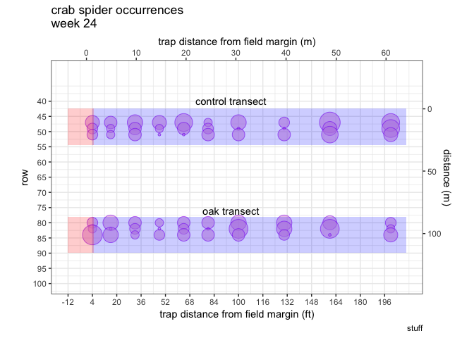
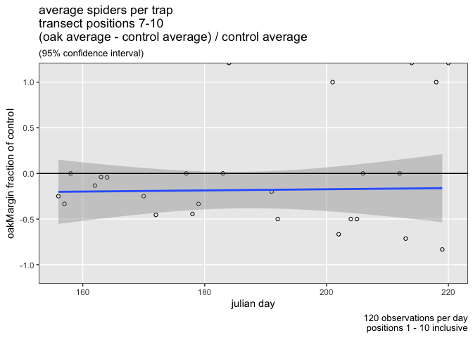

ampelos
================


``` r
source("./code/bug-library.R")
source("./code/similarity.R")
source("./code/jaccard-similarity.R")

source.url <- c("https://raw.githubusercontent.com/cordphelps/ampelos/master/data/bugs.csv")
bugs.df <- read.csv(source.url, header=TRUE, row.names=NULL)
```

is there a difference in the spider populations of the two transects?
---------------------------------------------------------------------

``` r
positionText <- paste("\ntransect positions ", "1-3", sep="")
g3 <- compareTransectUsingQuosure(data=bugs.df, 
                                 species=quo(Thomisidae..crab.spider.), 
                                 operator="LT",
                                 initialPosition=quo(4), 
                                 secondaryPosition=quo(0),
                                 positionText)
```


``` r
positionText <- paste("\ntransect positions ", "4-6", sep="")
g46 <- compareTransectUsingQuosure(data=bugs.df, 
                                 species=quo(Thomisidae..crab.spider.), 
                                 operator="BETWEEN",
                                 initialPosition=quo(3), 
                                 secondaryPosition=quo(7),
                                 positionText)
```


``` r
positionText <- paste("\ntransect positions ", "7-10", sep="")
g7 <- compareTransectUsingQuosure(data=bugs.df, 
                                 species=quo(Thomisidae..crab.spider.), 
                                 operator="GT",
                                 initialPosition=quo(6), 
                                 secondaryPosition=quo(0),
                                 positionText)
```


``` r
g <- arrangeGrob(g3, g46, g7, nrow=3)
newFile <- paste("ampelos-", format(Sys.time(), "%d-%m-%Y-%H%M"), ".pdf", sep = "")
ggsave(file=newFile, g, width=20, height=30, device = "pdf", units = "cm") #saves g
```

each of the two transects consists of 3 rows of 10 traps in each row. Is the total insect population relatively uniform among the 3 rows of a transect? Does this uniformity change over time? Compute the Jaccard Index for each week: the index *'is a statistic used for comparing the similarity and diversity of sample sets.'*
------------------------------------------------------------------------------------------------------------------------------------------------------------------------------------------------------------------------------------------------------------------------------------------------------------------------------------

### Note that *'the Jaccard index only counts mutual presence as matches and compares it to the number of attributes that have been chosen by at least one of the two sets.'* (<https://en.wikipedia.org/wiki/Jaccard_index>)

### TODO: evaluate the Simple matching coefficient (which also counts mutual absence): <https://en.wikipedia.org/wiki/Simple_matching_coefficient>

``` r
gOak <- compareJaccardMultiWeekV2(data=bugs.df, 
                                  transect=quo("oakMargin"),
                                  transectText="oakMargin")
```


``` r
gControl <- compareJaccardMultiWeekV2(data=bugs.df, 
                                      transect=quo("control"),
                                      transectText="control")
```


``` r
g <- arrangeGrob(gOak, gControl, nrow=2)
```

how about the insect populations themselves? Is the presence of any particular species correlated with the presence of a different species?
-------------------------------------------------------------------------------------------------------------------------------------------

``` r
m1 <- simMatrixV2(data=bugs.df, transect=quo("oakMargin"),
                                transectText="oakMargin")
```


``` r
m2 <- simMatrixV2(data=bugs.df, transect=quo("control"),
                                transectText="control")
```


``` r
g <- arrangeGrob(m1, m2, nrow=2)
```

does the crab spider population appear to change over time? Is there a difference between the two transects?
------------------------------------------------------------------------------------------------------------

``` r
# pass variables to dyplr pipes
# https://stackoverflow.com/questions/27975124/pass-arguments-to-dplyr-functions
plotSpeciesTrend(data=bugs.df, bugs=quo(Thomisidae..crab.spider.), speciesText="Crab Spider", where="control", when="pm", caption=Sys.Date())
```


    ## NULL

the crab spider is a dominant species in the vineyard. How are they distributed along the length of the row?
------------------------------------------------------------------------------------------------------------

``` r
plotRidges(data=bugs.df, combined=FALSE, bugs="Thomisidae..crab.spider.", speciesText="Crab Spider", where="control", when="pm", wk=1, caption=Sys.Date())
```

    ## Scale for 'x' is already present. Adding another scale for 'x', which
    ## will replace the existing scale.

    ## Picking joint bandwidth of 28.6



``` r
new.df <- bugs.df %>% mutate(newColumn = ifelse(Thomisidae..crab.spider. > 0, 1, 0))
plotRidges(data=new.df, combined=TRUE, bugs="newColumn", speciesText="Crab Spider", where="control", when="pm", wk=1, caption=Sys.Date())
```

    ## Scale for 'x' is already present. Adding another scale for 'x', which
    ## will replace the existing scale.

    ## Picking joint bandwidth of 18.7


``` r
plotRidges(data=new.df, combined=TRUE, bugs="newColumn", speciesText="Crab Spider", where="oakMargin", when="pm", wk=1, caption=Sys.Date())
```

    ## Scale for 'x' is already present. Adding another scale for 'x', which
    ## will replace the existing scale.

    ## Picking joint bandwidth of 19



what are the species counts?
----------------------------

<table>
<thead>
<tr>
<th style="text-align:left;">
</th>
<th style="text-align:right;">
count
</th>
<th style="text-align:right;">
percentage
</th>
</tr>
</thead>
<tbody>
<tr>
<td style="text-align:left;">
Diptera..Agromyzidae..leafminer..
</td>
<td style="text-align:right;">
695
</td>
<td style="text-align:right;">
22.18
</td>
</tr>
<tr>
<td style="text-align:left;">
Braconid.wasp
</td>
<td style="text-align:right;">
32
</td>
<td style="text-align:right;">
1.02
</td>
</tr>
<tr>
<td style="text-align:left;">
Halictus.sp....3.part..native.bee.
</td>
<td style="text-align:right;">
220
</td>
<td style="text-align:right;">
7.02
</td>
</tr>
<tr>
<td style="text-align:left;">
pencilBug
</td>
<td style="text-align:right;">
45
</td>
<td style="text-align:right;">
1.44
</td>
</tr>
<tr>
<td style="text-align:left;">
Agapostemon.sp....green..native.bee.
</td>
<td style="text-align:right;">
37
</td>
<td style="text-align:right;">
1.18
</td>
</tr>
<tr>
<td style="text-align:left;">
Osmia.sp...native.bee.
</td>
<td style="text-align:right;">
59
</td>
<td style="text-align:right;">
1.88
</td>
</tr>
<tr>
<td style="text-align:left;">
Honey.Bee
</td>
<td style="text-align:right;">
341
</td>
<td style="text-align:right;">
10.88
</td>
</tr>
<tr>
<td style="text-align:left;">
Bombus.californicus..bumble.
</td>
<td style="text-align:right;">
207
</td>
<td style="text-align:right;">
6.61
</td>
</tr>
<tr>
<td style="text-align:left;">
Thomisidae..crab.spider.
</td>
<td style="text-align:right;">
550
</td>
<td style="text-align:right;">
17.56
</td>
</tr>
<tr>
<td style="text-align:left;">
spider.other
</td>
<td style="text-align:right;">
62
</td>
<td style="text-align:right;">
1.98
</td>
</tr>
<tr>
<td style="text-align:left;">
ladyBug
</td>
<td style="text-align:right;">
24
</td>
<td style="text-align:right;">
0.77
</td>
</tr>
<tr>
<td style="text-align:left;">
Lygus.hesperus..western.tarnished.plant.bug.
</td>
<td style="text-align:right;">
31
</td>
<td style="text-align:right;">
0.99
</td>
</tr>
<tr>
<td style="text-align:left;">
pentamonidae...stinkBug.
</td>
<td style="text-align:right;">
10
</td>
<td style="text-align:right;">
0.32
</td>
</tr>
<tr>
<td style="text-align:left;">
other
</td>
<td style="text-align:right;">
762
</td>
<td style="text-align:right;">
24.32
</td>
</tr>
<tr>
<td style="text-align:left;">
checkerspot.butterfly
</td>
<td style="text-align:right;">
25
</td>
<td style="text-align:right;">
0.80
</td>
</tr>
<tr>
<td style="text-align:left;">
Pyralidae..Snout.Moth.
</td>
<td style="text-align:right;">
15
</td>
<td style="text-align:right;">
0.48
</td>
</tr>
<tr>
<td style="text-align:left;">
Diabrotica.undecimpunctata..Cucumber.Beetle.
</td>
<td style="text-align:right;">
10
</td>
<td style="text-align:right;">
0.32
</td>
</tr>
<tr>
<td style="text-align:left;">
Orius..pirate.bug.
</td>
<td style="text-align:right;">
8
</td>
<td style="text-align:right;">
0.26
</td>
</tr>
</tbody>
</table>
bird repellant streamers indicating the prevailing wind direction
-----------------------------------------------------------------


top of the control transect
---------------------------


bottom of the control transect with bird repellant streamers
------------------------------------------------------------


typical trap positioning; bowl in the fruit zone, vanes intersecting the canopy
-------------------------------------------------------------------------------


example trap sequence
---------------------


