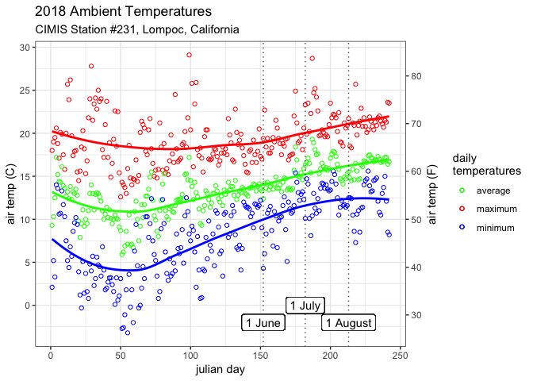
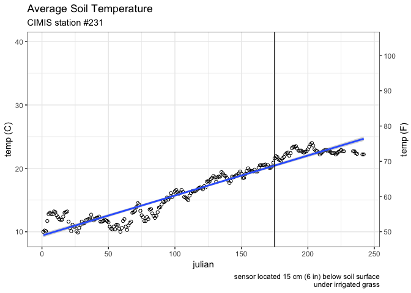
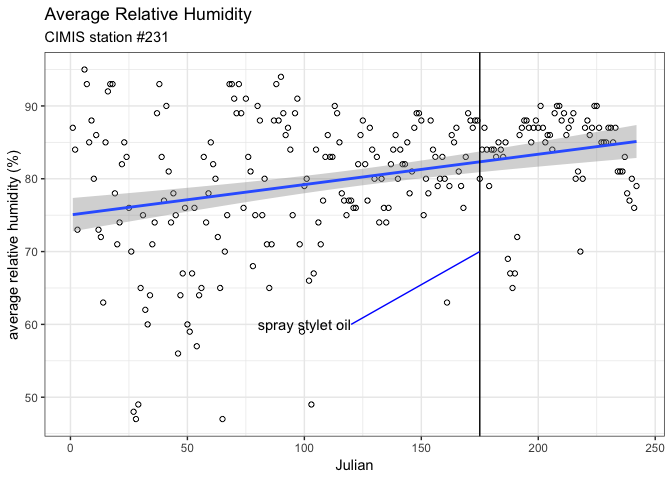
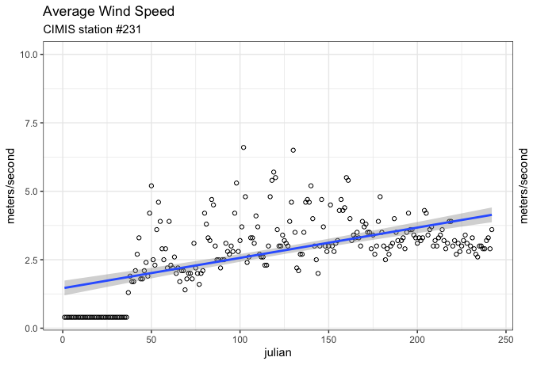

CIMIS
================

``` r
ampelos.ambient <- plot_grid(ambient231,
                             
            label_size=12, 
            label_fontface = "plain",
            axis="t",
            align = "v",
            ncol = 1,
            #rel_heights = c(1),      # applies to rows
            rel_widths = c(1),    # applies to columns
            scale = c(1)
          )

  # it is difficult to adjust the space between plots with plot_grid()
  # https://github.com/wilkelab/cowplot/issues/31
  # 
  
  print(ampelos.ambient)
```



``` r
  ampelos.ground <- plot_grid(ground231,
                             
            label_size=12, 
            label_fontface = "plain",
            axis="t",
            align = "v",
            ncol = 1,
            #rel_heights = c(1),      # applies to rows
            rel_widths = c(1),    # applies to columns
            scale = c(1)
          )

  # it is difficult to adjust the space between plots with plot_grid()
  # https://github.com/wilkelab/cowplot/issues/31
  # 
  
  print(ampelos.ground)
```



``` r
  ampelos.humidity <- plot_grid(humidity231,

            axis="t",
            align = "v",
            ncol = 1,
            #rel_heights = c(1),      # applies to rows
            rel_widths = c(1),    # applies to columns
            scale = c(1)
          )
  
  print(ampelos.humidity)
```



``` r
  ampelos.wind <- plot_grid(wind231,
          
            axis="t",
            align = "v",
            ncol = 1,
            #rel_heights = c(1),      # applies to rows
            rel_widths = c(1),    # applies to columns
            scale = c(1)
          )
  
  print(ampelos.wind)
```


