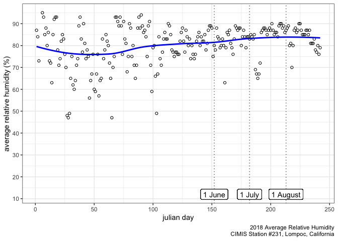
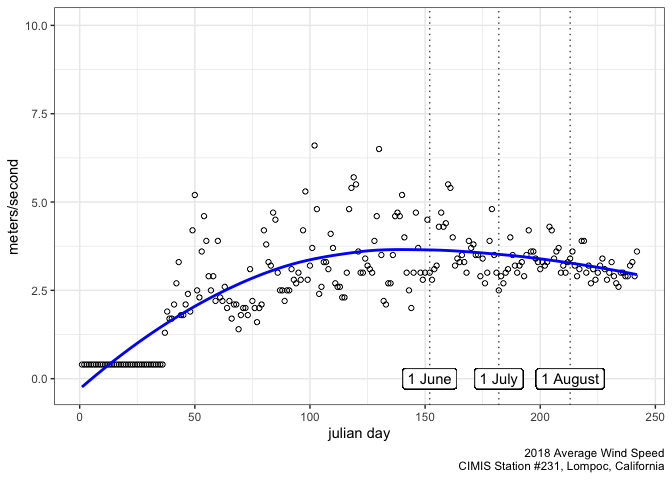

CIMIS
================

    ## Scale for 'y' is already present. Adding another scale for 'y', which
    ## will replace the existing scale.
    ## Scale for 'y' is already present. Adding another scale for 'y', which
    ## will replace the existing scale.
    ## Scale for 'y' is already present. Adding another scale for 'y', which
    ## will replace the existing scale.

``` r
print(ambient231)
```


``` r
print(precip231)
```


``` r
print(humidity231)
```

    ## Warning: Removed 2 rows containing non-finite values (stat_smooth).

    ## Warning: Removed 2 rows containing missing values (geom_point).



``` r
print(ground231)
```

    ## Warning: Removed 9 rows containing non-finite values (stat_smooth).

    ## Warning: Removed 9 rows containing missing values (geom_point).


``` r
print(wind231)
```


