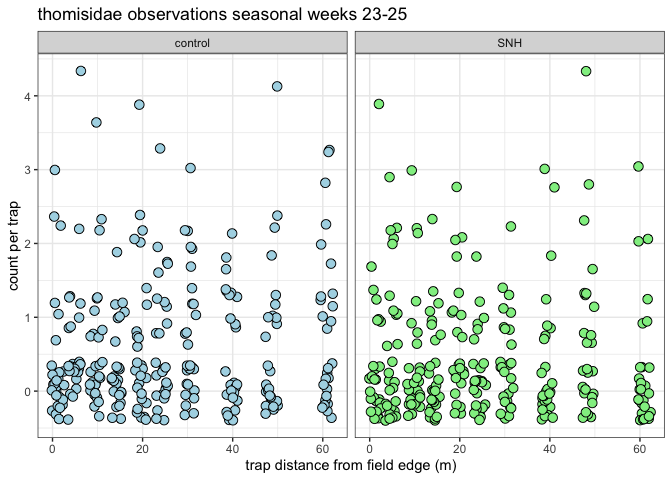
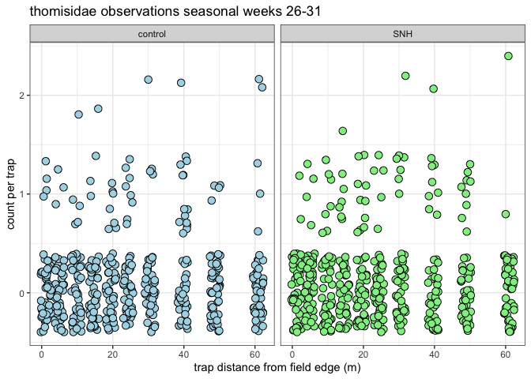
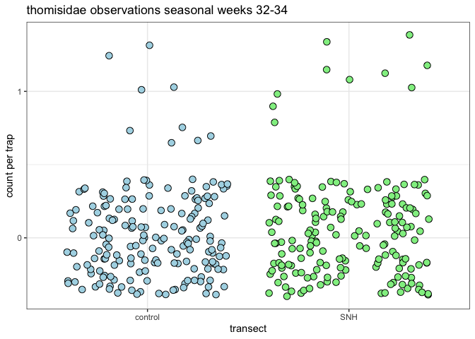
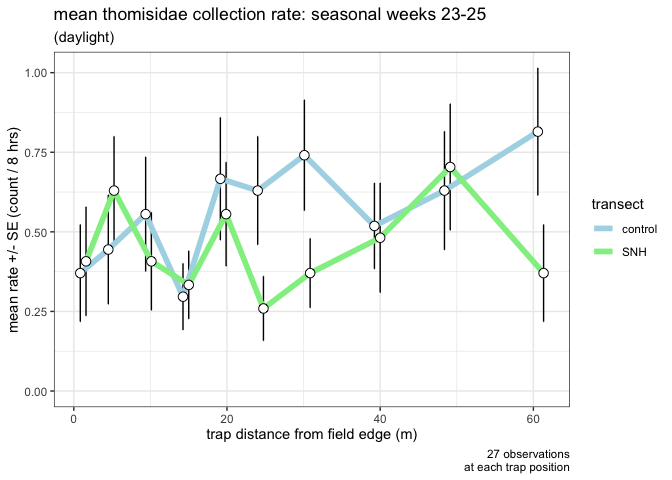
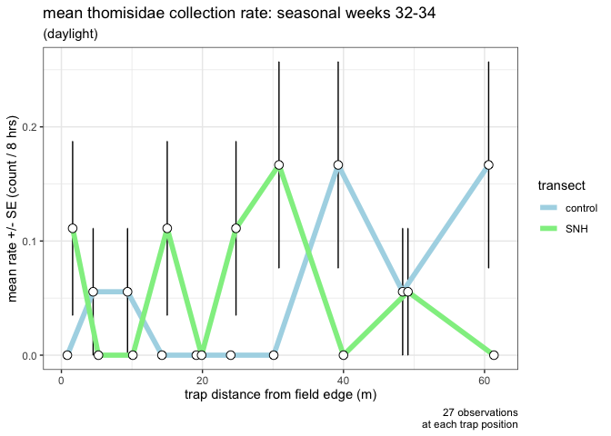
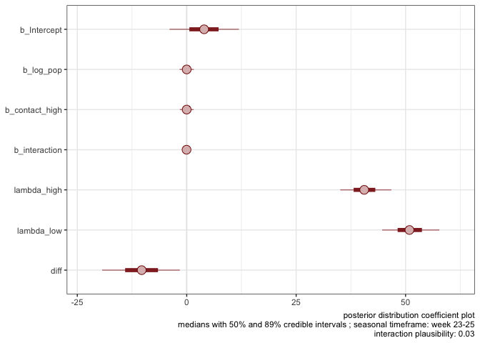

ampelos V2
================

    Cohen's d measure of effect size

d: 0.348 data:
thomisidae.period1.SNH.tibl\(totalSpiders thomisidae.period1.control.tibl\)totalSpiders
m1 = 13.56 m2 = 17 sd1 = 9.59 sd2 = 10.17 pooled variance: 97.764

    Cohen's d measure of effect size

d: 0.0439 data:
thomisidae.period2.SNH.tibl\(totalSpiders thomisidae.period2.control.tibl\)totalSpiders
m1 = 4.12 m2 = 4 sd1 = 2.39 sd2 = 3.25 pooled variance: 8.125

    Cohen's d measure of effect size

d: 0.0893 data:
thomisidae.period3.SNH.tibl\(totalSpiders thomisidae.period3.control.tibl\)totalSpiders
m1 = 1.67 m2 = 1.5 sd1 = 1.86 sd2 = 1.87 pooled variance: 3.483

<table>

<caption>

Comparison of SNH and control weekly daytime trapped crab spider counts
(Wilcoxon signed-rank test)

</caption>

<thead>

<tr>

<th style="text-align:left;">

seasonal period

</th>

<th style="text-align:center;">

Cohen’s d effect size

</th>

<th style="text-align:center;">

SNH transect mean spiders per week (across 30 traps)

</th>

<th style="text-align:center;">

control transect mean spiders per week (across 30 traps)

</th>

</tr>

</thead>

<tbody>

<tr>

<td style="text-align:left;">

weeks 23-25

</td>

<td style="text-align:center;">

0.35

</td>

<td style="text-align:center;">

13.56

</td>

<td style="text-align:center;">

17.0

</td>

</tr>

<tr>

<td style="text-align:left;">

weeks 26-31

</td>

<td style="text-align:center;">

0.04

</td>

<td style="text-align:center;">

4.12

</td>

<td style="text-align:center;">

4.0

</td>

</tr>

<tr>

<td style="text-align:left;">

weeks 32-34

</td>

<td style="text-align:center;">

0.09

</td>

<td style="text-align:center;">

1.67

</td>

<td style="text-align:center;">

1.5

</td>

</tr>

</tbody>

</table>

<table>

<caption>

power analysis by seasonal period: two sample t test

</caption>

<thead>

<tr>

<th style="text-align:left;">

seasonal period

</th>

<th style="text-align:center;">

Cohen’s d effect size (calculated)

</th>

<th style="text-align:center;">

alpha (proposed)

</th>

<th style="text-align:center;">

sample size (actual)

</th>

<th style="text-align:center;">

power (calculated)

</th>

</tr>

</thead>

<tbody>

<tr>

<td style="text-align:left;">

weeks 23-25

</td>

<td style="text-align:center;">

0.35

</td>

<td style="text-align:center;">

0.05

</td>

<td style="text-align:center;">

270

</td>

<td style="text-align:center;">

0.98

</td>

</tr>

<tr>

<td style="text-align:left;">

weeks 26-31

</td>

<td style="text-align:center;">

0.04

</td>

<td style="text-align:center;">

0.05

</td>

<td style="text-align:center;">

480

</td>

<td style="text-align:center;">

0.10

</td>

</tr>

<tr>

<td style="text-align:left;">

weeks 32-34

</td>

<td style="text-align:center;">

0.09

</td>

<td style="text-align:center;">

0.05

</td>

<td style="text-align:center;">

180

</td>

<td style="text-align:center;">

0.13

</td>

</tr>

</tbody>

</table>

<table>

<caption>

Comparison of daylight and night-time weekly trapped spider counts by
transect (Wilcoxon signed-rank test)

</caption>

<thead>

<tr>

<th style="text-align:left;">

transect

</th>

<th style="text-align:center;">

p value

</th>

<th style="text-align:center;">

effect metric

</th>

<th style="text-align:center;">

effect magnitude

</th>

</tr>

</thead>

<tbody>

<tr>

<td style="text-align:left;">

SNH

</td>

<td style="text-align:center;">

0.012

</td>

<td style="text-align:center;">

0.469

</td>

<td style="text-align:center;">

moderate

</td>

</tr>

<tr>

<td style="text-align:left;">

control

</td>

<td style="text-align:center;">

0.011

</td>

<td style="text-align:center;">

0.436

</td>

<td style="text-align:center;">

moderate

</td>

</tr>

</tbody>

</table>

<table>

<caption>

Comparison of SNH and control weekly daytime trapped spider counts by
seasonal period (Wilcoxon signed-rank test)

</caption>

<thead>

<tr>

<th style="text-align:left;">

seasonal period

</th>

<th style="text-align:center;">

p value

</th>

<th style="text-align:center;">

effect metric

</th>

<th style="text-align:center;">

effect magnitude

</th>

</tr>

</thead>

<tbody>

<tr>

<td style="text-align:left;">

weeks 23-25

</td>

<td style="text-align:center;">

0.043

</td>

<td style="text-align:center;">

0.695

</td>

<td style="text-align:center;">

large

</td>

</tr>

<tr>

<td style="text-align:left;">

weeks 26-31

</td>

<td style="text-align:center;">

0.797

</td>

<td style="text-align:center;">

0.071

</td>

<td style="text-align:center;">

small

</td>

</tr>

<tr>

<td style="text-align:left;">

weeks 31-34

</td>

<td style="text-align:center;">

0.890

</td>

<td style="text-align:center;">

0.131

</td>

<td style="text-align:center;">

small

</td>

</tr>

</tbody>

</table>

<table>

<caption>

<b>interaction model statistics for a hypothetical population by time
period</b>

</caption>

<thead>

<tr>

<th style="text-align:left;">

seasonal period

</th>

<th style="text-align:center;">

population exposed to the traps (as an example)

</th>

<th style="text-align:center;">

SNH transect modelled mean trapped spiders (percent)

</th>

<th style="text-align:center;">

control transect modelled mean trapped spiders (percent)

</th>

</tr>

</thead>

<tbody>

<tr>

<td style="text-align:left;">

weeks 23-25

</td>

<td style="text-align:center;">

136

</td>

<td style="text-align:center;">

30.0

</td>

<td style="text-align:center;">

37.6

</td>

</tr>

<tr>

<td style="text-align:left;">

weeks 26-31

</td>

<td style="text-align:center;">

41

</td>

<td style="text-align:center;">

28.6

</td>

<td style="text-align:center;">

29.1

</td>

</tr>

<tr>

<td style="text-align:left;">

weeks 31-34

</td>

<td style="text-align:center;">

17

</td>

<td style="text-align:center;">

34.0

</td>

<td style="text-align:center;">

26.0

</td>

</tr>

</tbody>

</table>

