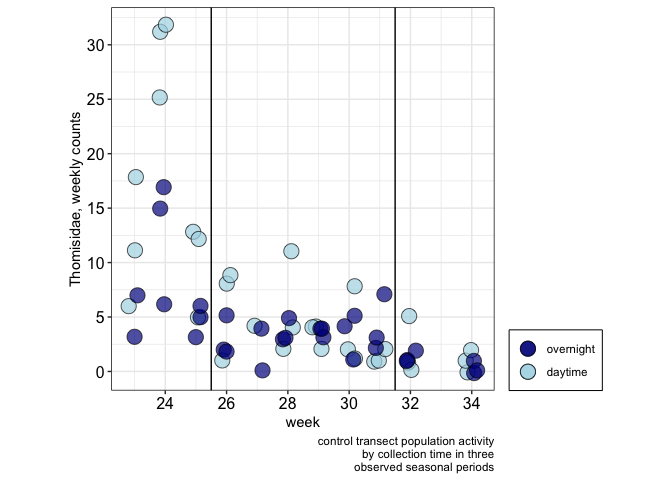
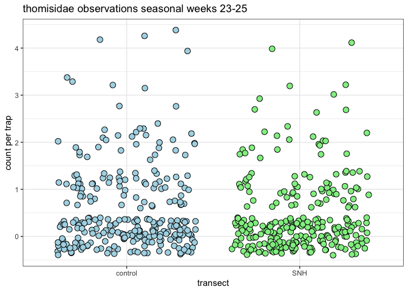
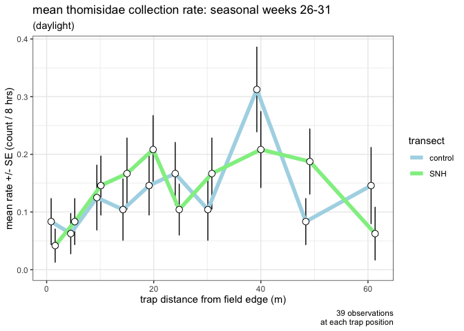
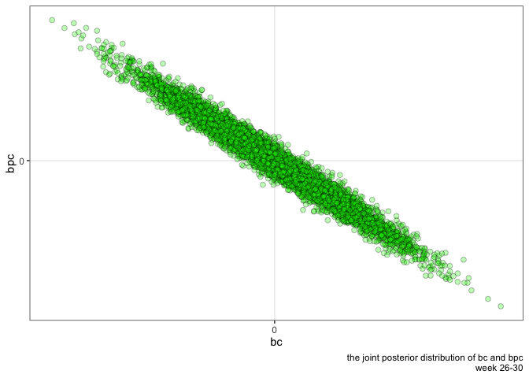

ampelos V2
================

    ## `summarise()` ungrouping output (override with `.groups` argument)
    ## `summarise()` ungrouping output (override with `.groups` argument)
    ## `summarise()` ungrouping output (override with `.groups` argument)
    ## `summarise()` ungrouping output (override with `.groups` argument)
    ## `summarise()` ungrouping output (override with `.groups` argument)
    ## `summarise()` ungrouping output (override with `.groups` argument)

| period  | cohens.d | sig.level | power | impliedSampleSize | actualSampleSize |
| :------ | -------: | --------: | ----: | ----------------: | ---------------: |
| period1 |     0.76 |      0.05 |   0.8 |                27 |              540 |
| period2 |     0.06 |      0.05 |   0.8 |              3942 |              960 |
| period3 |     0.09 |      0.05 |   0.8 |              2172 |              360 |

    ## Warning: Ignoring unknown parameters: width

