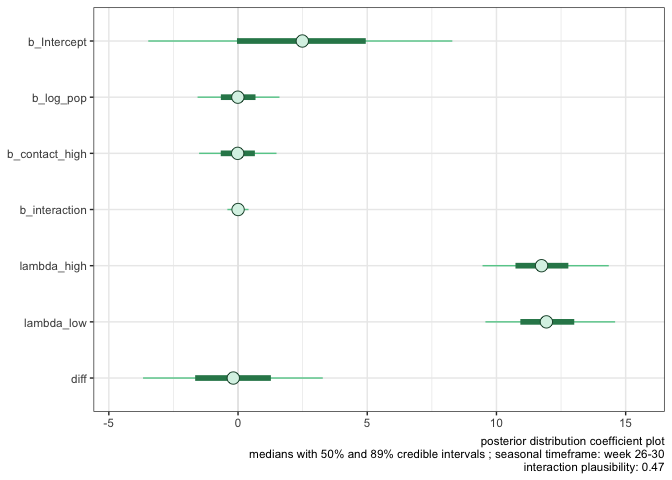
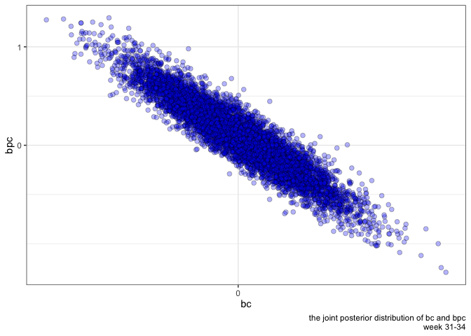

ampelos V2
================

    ## `summarise()` ungrouping output (override with `.groups` argument)
    ## `summarise()` ungrouping output (override with `.groups` argument)
    ## `summarise()` ungrouping output (override with `.groups` argument)
    ## `summarise()` ungrouping output (override with `.groups` argument)
    ## `summarise()` ungrouping output (override with `.groups` argument)
    ## `summarise()` ungrouping output (override with `.groups` argument)

    ## Warning in chisq.test(groupSNH$mean, groupControl$mean): Chi-squared
    ## approximation may be incorrect

| transect | dispersion index | degrees of freedom | chi squared |
| :------- | :--------------: | :----------------: | :---------: |
| SNH      |      0.043       |         9          |    0.387    |
| control  |      0.047       |         9          |   60.000    |

Comparison of SNH and Control trapped spider means by position (Chi
Squared test)

| transect | p value | effect metric | effect magnitude |
| :------- | :-----: | :-----------: | :--------------: |
| SNH      |  0.012  |     0.469     |     moderate     |
| control  |  0.011  |     0.436     |     moderate     |

Comparison of daylight and nighttime trapped spider counts (Wilcoxon
signed-rank test)

| transect | wilcox.p | effectSize | comment  |
| :------- | -------: | ---------: | :------- |
| SNH      |    0.012 |      0.469 | moderate |
| control  |    0.011 |      0.436 | moderate |

    ## Warning: Ignoring unknown parameters: width

