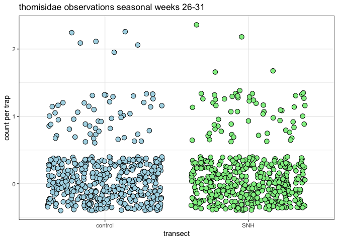

ampelos V2
================

## Can the influence of ‘semi-natural habitat’ (SNH) field margin be quantified in the context of the population of beneficial spiders in an organic vineyard?

### typical trap positioning; bowl in the fruit zone, vanes intersecting the canopy

### example trap sequence

