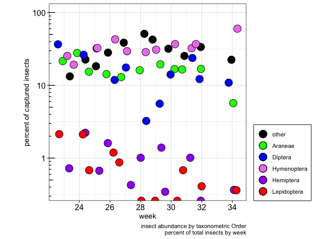
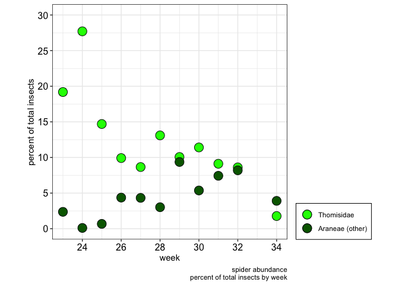
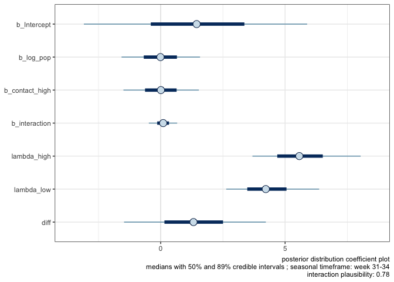
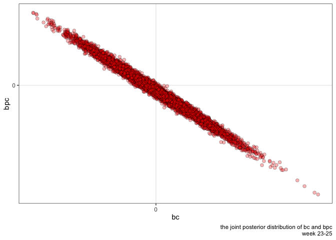
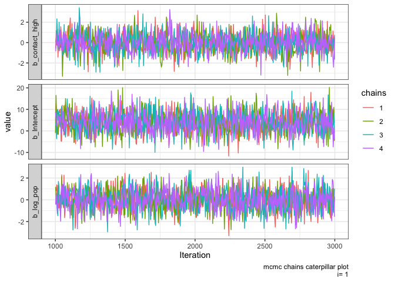

ampelos V2
================

| seasonal period | Cohen’s d effect size | SNH transect mean spiders per week | control transect mean spiders per week |
| :-------------- | :-------------------: | :--------------------------------: | :------------------------------------: |
| weeks 23-25     |         0.348         |               13.556               |                  17.0                  |
| weeks 26-31     |         0.044         |               4.125                |                  4.0                   |
| weeks 32-34     |         0.089         |               1.667                |                  1.5                   |

Comparison of SNH and control weekly daytime trapped crab spider counts
(Wilcoxon signed-rank test)

| seasonal period | Cohen’s d effect size | alpha | power | actual sample size |
| :-------------- | :-------------------: | :---: | :---: | :----------------: |
| weeks 23-25     |         0.35          | 0.05  | 0.981 |        270         |
| weeks 26-31     |         0.04          | 0.05  | 0.104 |        480         |
| weeks 32-34     |         0.09          | 0.05  | 0.135 |        180         |

power analysis by seasonal period: two sample t test

| transect | p value | effect metric | effect magnitude |
| :------- | :-----: | :-----------: | :--------------: |
| SNH      |  0.012  |     0.469     |     moderate     |
| control  |  0.011  |     0.436     |     moderate     |

Comparison of daylight and night-time weekly trapped spider counts by
transect (Wilcoxon signed-rank test)

| seasonal period | p value | effect metric | effect magnitude |
| :-------------- | :-----: | :-----------: | :--------------: |
| weeks 23-25     |  0.043  |     0.695     |      large       |
| weeks 26-31     |  0.797  |     0.071     |      small       |
| weeks 31-34     |  0.890  |     0.131     |      small       |

Comparison of SNH and control weekly daytime trapped spider counts by
seasonal period (Wilcoxon signed-rank test)

