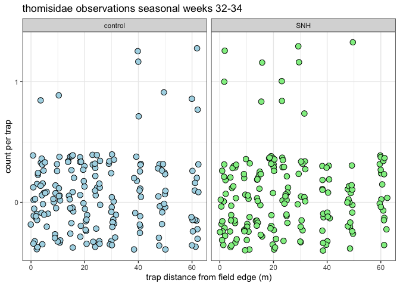
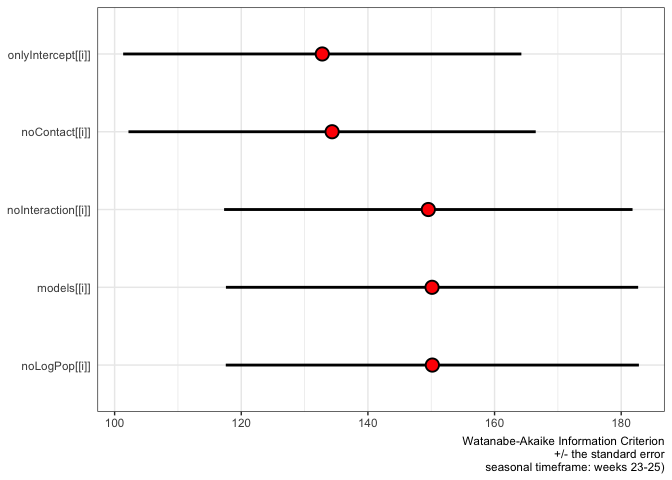

ampelos V2
================

``` r
library(tidyr)
library(dplyr)
```

    ## 
    ## Attaching package: 'dplyr'

    ## The following objects are masked from 'package:stats':
    ## 
    ##     filter, lag

    ## The following objects are masked from 'package:base':
    ## 
    ##     intersect, setdiff, setequal, union

``` r
library(ggplot2)

# "weeks 23-25",  "weeks 26-31", "weeks 32-34"

source.url <- c("https://raw.githubusercontent.com/cordphelps/ampelos/master/data/bugs.csv")


bugs.tibl <- as_tibble(read.csv(source.url, header=TRUE, row.names=NULL))


thomisidae.period1.oakMargin.tibl <- bugs.tibl %>% 
  filter(time != 'am') %>%
  filter(transect == 'oakMargin') %>%
  filter(week < 26) %>%
  group_by(position) %>%
    summarize(mean = mean(Thomisidae..crab.spider., na.rm=TRUE))
```

    ## `summarise()` ungrouping output (override with `.groups` argument)

``` r
thomisidae.period1.control.tibl <- bugs.tibl %>% 
  filter(time != 'am') %>%
  filter(transect == 'control') %>%
  filter(week < 26) %>%
  group_by(position) %>%
    summarize(mean = mean(Thomisidae..crab.spider., na.rm=TRUE))
```

    ## `summarise()` ungrouping output (override with `.groups` argument)

``` r
thomisidae.period2.oakMargin.tibl <- bugs.tibl %>% 
  filter(time != 'am') %>%
  filter(transect == 'oakMargin') %>%
  filter(week > 25 & week < 32) %>%
  group_by(position) %>%
    summarize(mean = mean(Thomisidae..crab.spider., na.rm=TRUE))
```

    ## `summarise()` ungrouping output (override with `.groups` argument)

``` r
thomisidae.period2.control.tibl <- bugs.tibl %>% 
  filter(time != 'am') %>%
  filter(transect == 'control') %>%
  filter(week > 25 & week < 32) %>%
  group_by(position) %>%
    summarize(mean = mean(Thomisidae..crab.spider., na.rm=TRUE))
```

    ## `summarise()` ungrouping output (override with `.groups` argument)

``` r
thomisidae.period3.oakMargin.tibl <- bugs.tibl %>% 
  filter(time != 'am') %>%
  filter(transect == 'oakMargin') %>%
  filter(week > 31) %>%
  group_by(position) %>%
    summarize(mean = mean(Thomisidae..crab.spider., na.rm=TRUE))
```

    ## `summarise()` ungrouping output (override with `.groups` argument)

``` r
thomisidae.period3.control.tibl <- bugs.tibl %>% 
  filter(time != 'am') %>%
  filter(transect == 'control') %>%
  filter(week > 31) %>%
  group_by(position) %>%
    summarize(mean = mean(Thomisidae..crab.spider., na.rm=TRUE))
```

    ## `summarise()` ungrouping output (override with `.groups` argument)

``` r
combo.period1.tibl <- bugs.tibl %>% 
  filter(time != 'am') %>%
  filter(week < 26)

combo.period2.tibl <- bugs.tibl %>% 
  filter(time != 'am') %>%
  filter(week > 25 & week < 32)

combo.period3.tibl <- bugs.tibl %>% 
  filter(time != 'am') %>%
  filter(week > 31)


library(JGmisc)
```

    ## Loading required package: magrittr

    ## 
    ## Attaching package: 'magrittr'

    ## The following object is masked from 'package:tidyr':
    ## 
    ##     extract

``` r
JGmisc::cohens.d(thomisidae.period1.oakMargin.tibl$mean, thomisidae.period1.control.tibl$mean)
```

    ## 
    ##  Cohen's d measure of effect size
    ## 
    ## d: 0.757
    ## data: thomisidae.period1.oakMargin.tibl$mean thomisidae.period1.control.tibl$mean
    ## m1 = 0.45    m2 = 0.57
    ## sd1 = 0.14   sd2 = 0.16
    ## pooled variance: 0.023

``` r
JGmisc::cohens.d(thomisidae.period2.oakMargin.tibl$mean, thomisidae.period2.control.tibl$mean)
```

    ## 
    ##  Cohen's d measure of effect size
    ## 
    ## d: 0.0631
    ## data: thomisidae.period2.oakMargin.tibl$mean thomisidae.period2.control.tibl$mean
    ## m1 = 0.14    m2 = 0.13
    ## sd1 = 0.06   sd2 = 0.07
    ## pooled variance: 0.004

``` r
JGmisc::cohens.d(thomisidae.period3.oakMargin.tibl$mean, thomisidae.period3.control.tibl$mean)
```

    ## 
    ##  Cohen's d measure of effect size
    ## 
    ## d: 0.085
    ## data: thomisidae.period3.oakMargin.tibl$mean thomisidae.period3.control.tibl$mean
    ## m1 = 0.06    m2 = 0.05
    ## sd1 = 0.06   sd2 = 0.07
    ## pooled variance: 0.004

``` r
# effect size, early season: d = 0.757   ('large' Cohen 1988)
# effect size, mid season:   d = 0.0348  ('very small' Sawilowsky, 2009)
# effect size, late season:  d = 0.299   ('small-medium' Cohen 1988)
#
#
# Altieri figure 4
# approx effect size, early season: (negative)
# approx effect size, mid season:   approx .5 'medium'
# approx effect size, late season:  approx .2 'small'

pwr::pwr.2p.test(h=0.757, sig.level=0.05, power=0.8)
```

    ## 
    ##      Difference of proportion power calculation for binomial distribution (arcsine transformation) 
    ## 
    ##               h = 0.757
    ##               n = 27.39333
    ##       sig.level = 0.05
    ##           power = 0.8
    ##     alternative = two.sided
    ## 
    ## NOTE: same sample sizes



    ## Warning in wilcox.test.default(x = c(0.37037037037037, 0.444444444444444, :
    ## cannot compute exact p-value with ties

    ## Warning in wilcox.test.default(x = c(0.0833333333333333, 0.0625, 0.125, : cannot
    ## compute exact p-value with ties

    ## Warning in wilcox.test.default(x = c(0, 0.0555555555555556,
    ## 0.0555555555555556, : cannot compute exact p-value with ties


    ## Warning: Ignoring unknown parameters: width

    ## Warning in rm(label.lst): object 'label.lst' not found



