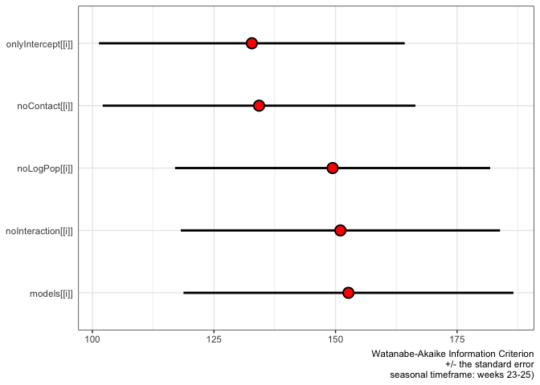
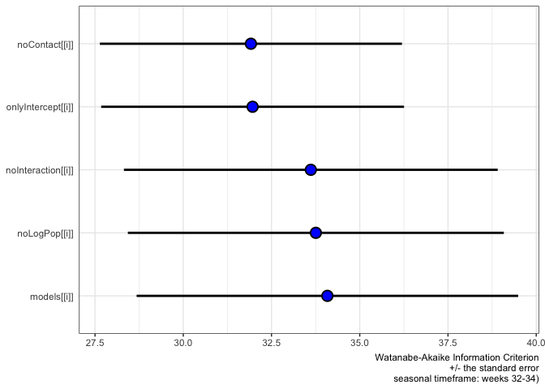

ampelos V2
================

``` r
densityFacets <- function(tibble, periodString) {
  
  gg <- ggplot(data = tibble, # add the data
       aes(x = positionX / 3.281, y = Thomisidae..crab.spider.,
           color = transect)) +   
    geom_jitter() +
    facet_grid(~transect) +
    #scale_x_continuous(breaks = seq(0, 200, 1)) +
    
    labs(title = paste("thomisidae observations seasonal ",
                        periodString, sep=""),
       x = "trap distance from field edge (m)", 
       y = "count") +
  
    scale_y_continuous(breaks = seq(0, 4, 1)) +
    theme_bw() +
  
    theme(legend.position="none") +
  
    scale_colour_hue(name="transect",    # Legend label, use darker colors
                  breaks=c("SNH", "control"),
                  labels=c("SNH", "control"),
                  l=40)             # Use darker colors, lightness=40
  
  return(gg)
  
}

densityNoFacets <- function(tibble, periodString) {
  
  gg <- ggplot(data = tibble, # add the data
       aes(x = transect, y = Thomisidae..crab.spider., # set x, y coordinates
           color = transect)) +    # color by treatment
    geom_jitter() +
    
    labs(title = paste("thomisidae observations seasonal ",
                        periodString, sep=""),
       x = "transect", 
       y = "counts") +
    
    scale_y_continuous(breaks = seq(0, 4, 1)) +
  
    theme_bw() +
  
    theme(legend.position="none") 
  
  return(gg)
}


errorBars <- function(tibble, periodString, observations) {
  
  # http://www.cookbook-r.com/Graphs/Plotting_means_and_error_bars_(ggplot2)/

  # The errorbars overlapped, so use position_dodge to move them horizontally
  pd <- position_dodge(1.5) # move them .05 to the left and right

  gg <- ggplot(tibble, aes(x=positionX / 3.281, y=mean, colour=transect, group=transect)) + 
    geom_errorbar(aes(ymin=mean-se, ymax=mean+se), colour="black", width=.1, position=pd) +
    geom_line(position=pd) +
    geom_point(position=pd, size=3, shape=21, fill="white") + # 21 is filled circle
  
    labs(title = paste("mean thomisidae collection rate: seasonal ",
                        periodString, sep=""),
       subtitle = "(daylight)",
       caption = paste(observations, 
                       " observations\n at each trap position", sep=""),
       x = "trap distance from field edge (m)", 
       y = "mean rate +/- SE (count / 8 hrs)") +
  
    scale_colour_hue(name="transect",    # Legend label, use darker colors
                     breaks=c("oakMargin", "control"),
                     labels=c("SNH", "control"),
                     l=40) +            # Use darker colors, lightness=40

    expand_limits(y=0) +                        # Expand y range
    scale_y_continuous() +
    scale_x_continuous(breaks = seq(0, 60, 20)) +
  
    theme_bw() 
  
  return(gg)
  
}
```

``` r
library(tidyr)
library(dplyr)
```

    ## 
    ## Attaching package: 'dplyr'

    ## The following objects are masked from 'package:stats':
    ## 
    ##     filter, lag

    ## The following objects are masked from 'package:base':
    ## 
    ##     intersect, setdiff, setequal, union

``` r
library(ggplot2)

# "weeks 23-25",  "weeks 26-30", "weeks 31-34"

source.url <- c("https://raw.githubusercontent.com/cordphelps/ampelos/master/data/bugs.csv")


bugs.tibl <- as_tibble(read.csv(source.url, header=TRUE, row.names=NULL))


thomisidae.period1.oakMargin.tibl <- bugs.tibl %>% 
  filter(time != 'am') %>%
  filter(transect == 'oakMargin') %>%
  filter(week < 26) %>%
  group_by(position) %>%
    summarize(mean = mean(Thomisidae..crab.spider., na.rm=TRUE))
```

    ## `summarise()` ungrouping output (override with `.groups` argument)

``` r
thomisidae.period1.control.tibl <- bugs.tibl %>% 
  filter(time != 'am') %>%
  filter(transect == 'control') %>%
  filter(week < 26) %>%
  group_by(position) %>%
    summarize(mean = mean(Thomisidae..crab.spider., na.rm=TRUE))
```

    ## `summarise()` ungrouping output (override with `.groups` argument)

``` r
thomisidae.period2.oakMargin.tibl <- bugs.tibl %>% 
  filter(time != 'am') %>%
  filter(transect == 'oakMargin') %>%
  filter(week > 25 & week < 31) %>%
  group_by(position) %>%
    summarize(mean = mean(Thomisidae..crab.spider., na.rm=TRUE))
```

    ## `summarise()` ungrouping output (override with `.groups` argument)

``` r
thomisidae.period2.control.tibl <- bugs.tibl %>% 
  filter(time != 'am') %>%
  filter(transect == 'control') %>%
  filter(week > 25 & week < 31) %>%
  group_by(position) %>%
    summarize(mean = mean(Thomisidae..crab.spider., na.rm=TRUE))
```

    ## `summarise()` ungrouping output (override with `.groups` argument)

``` r
thomisidae.period3.oakMargin.tibl <- bugs.tibl %>% 
  filter(time != 'am') %>%
  filter(transect == 'oakMargin') %>%
  filter(week > 30) %>%
  group_by(position) %>%
    summarize(mean = mean(Thomisidae..crab.spider., na.rm=TRUE))
```

    ## `summarise()` ungrouping output (override with `.groups` argument)

``` r
thomisidae.period3.control.tibl <- bugs.tibl %>% 
  filter(time != 'am') %>%
  filter(transect == 'control') %>%
  filter(week > 30) %>%
  group_by(position) %>%
    summarize(mean = mean(Thomisidae..crab.spider., na.rm=TRUE))
```

    ## `summarise()` ungrouping output (override with `.groups` argument)

``` r
library(JGmisc)
```

    ## Loading required package: magrittr

    ## 
    ## Attaching package: 'magrittr'

    ## The following object is masked from 'package:tidyr':
    ## 
    ##     extract

``` r
JGmisc::cohens.d(thomisidae.period1.oakMargin.tibl$mean, thomisidae.period1.control.tibl$mean)
```

    ## 
    ##  Cohen's d measure of effect size
    ## 
    ## d: 0.757
    ## data: thomisidae.period1.oakMargin.tibl$mean thomisidae.period1.control.tibl$mean
    ## m1 = 0.45    m2 = 0.57
    ## sd1 = 0.14   sd2 = 0.16
    ## pooled variance: 0.023

``` r
JGmisc::cohens.d(thomisidae.period2.oakMargin.tibl$mean, thomisidae.period2.control.tibl$mean)
```

    ## 
    ##  Cohen's d measure of effect size
    ## 
    ## d: 0.0348
    ## data: thomisidae.period2.oakMargin.tibl$mean thomisidae.period2.control.tibl$mean
    ## m1 = 0.15    m2 = 0.15
    ## sd1 = 0.07   sd2 = 0.08
    ## pooled variance: 0.005

``` r
JGmisc::cohens.d(thomisidae.period3.oakMargin.tibl$mean, thomisidae.period3.control.tibl$mean)
```

    ## 
    ##  Cohen's d measure of effect size
    ## 
    ## d: 0.299
    ## data: thomisidae.period3.oakMargin.tibl$mean thomisidae.period3.control.tibl$mean
    ## m1 = 0.06    m2 = 0.05
    ## sd1 = 0.05   sd2 = 0.05
    ## pooled variance: 0.002

``` r
# effect size, early season: d = 0.757   ('large' Cohen 1988)
# effect size, mid season:   d = 0.0348  ('very small' Sawilowsky, 2009)
# effect size, late season:  d = 0.299   ('small-medium' Cohen 1988)
#
#
# Altieri figure 4
# approx effect size, early season: (negative)
# approx effect size, mid season:   approx .5 'medium'
# approx effect size, late season:  approx .2 'small'

pwr::pwr.2p.test(h=0.757, sig.level=0.05, power=0.8)
```

    ## 
    ##      Difference of proportion power calculation for binomial distribution (arcsine transformation) 
    ## 
    ##               h = 0.757
    ##               n = 27.39333
    ##       sig.level = 0.05
    ##           power = 0.8
    ##     alternative = two.sided
    ## 
    ## NOTE: same sample sizes


    ## Warning in wilcox.test.default(x = c(0.37037037037037, 0.444444444444444, :
    ## cannot compute exact p-value with ties

    ## Warning in wilcox.test.default(x = c(0.102564102564103, 0.0769230769230769, :
    ## cannot compute exact p-value with ties

    ## Warning in wilcox.test.default(x = c(0, 0.037037037037037, 0.037037037037037, :
    ## cannot compute exact p-value with ties


    ## Warning: 'rstan' namespace cannot be unloaded:
    ##   namespace 'rstan' is imported by 'brms' so cannot be unloaded

    ## Warning: 'bayesplot' namespace cannot be unloaded:
    ##   namespace 'bayesplot' is imported by 'shinystan', 'brms' so cannot be unloaded

    ## Warning: Removed 1 rows containing missing values (geom_point).
    
    ## Warning: Removed 1 rows containing missing values (geom_point).


    ## Warning: .onUnload failed in unloadNamespace() for 'rstan', details:
    ##   call: tbbmalloc_proxyDllInfo <<- NULL
    ##   error: cannot change value of locked binding for 'tbbmalloc_proxyDllInfo'


